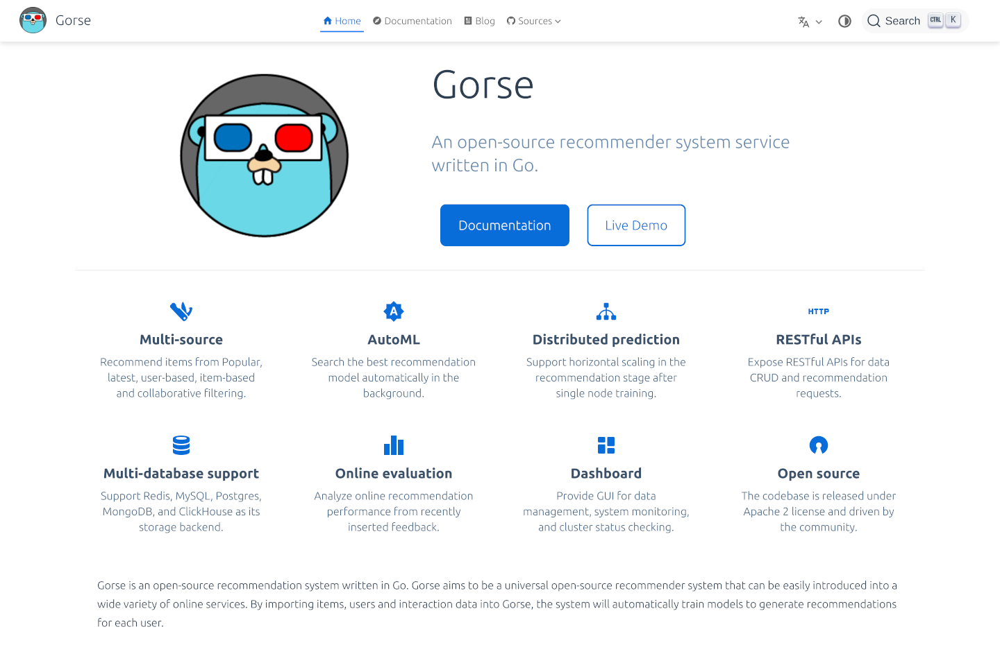

# Gorse Docs

[](https://app.netlify.com/sites/gorse-io/deploys)

Official documents for Gorse recommender system.



## Setup environment

This is a [VuePress](https://vuepress.vuejs.org/) project, so you need to install:

- [Node.js](https://nodejs.org/en/)
- [Yarn](https://yarnpkg.com/)

## Install dependencies and run

```bash
# Clone the repository
git clone git@github.com:gorse-io/docs.git

# Change directory
cd docs

# Install dependencies
yarn install

# Run Gorse Docs on http://localhost:8080
yarn docs:dev
```

## Deployment

Gorse Docs is deployed as a static website. The main branch is deployed at https://gorse.io.

You can build the static website like this:

```bash
 yarn docs:build
```

The static files will be available in `.vuepress/dist`.

## Localization

Welcome to translate the Gorse document into more languages on [GitLocalize](https://gitlocalize.com/repo/8172).

| Language | Progress |
| --- | --- |
| Chinese | [](https://gitlocalize.com/repo/8172/zh?utm_source=badge) |

## Acknowledgments

- The [VuePress](https://vuepress.vuejs.org/) version of documents is contributed by [@andresribeiro](https://github.com/andresribeiro).
- The theme of VuePress is [vuepress-theme-hope](https://vuepress-theme-hope.github.io/v2/).
