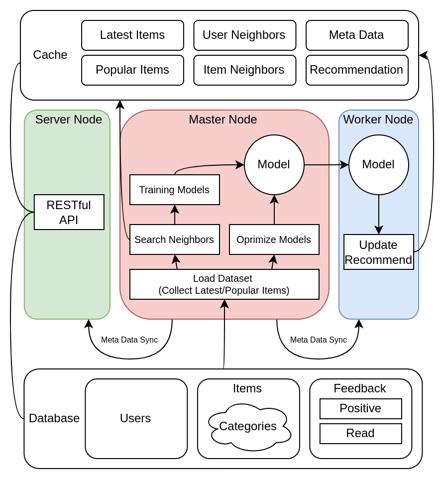

# Build Recommender

Recommender systems are complex. The overall workflow in Gorse is as follows:

<center></center>

- Users, items and feedbacks are stored in **database** (a.k.a. `data_store` in config file). [Item Management](item-management) introduces how to manage items in Gorse. Feedbacks are required to generate personalized recommendations for user, which is discussed in [Feedback Collection](feedback-collection).
- Latest items, popular items, user neighbors, item neighbors, recommendations and meta data are store in **cache** (a.k.a `cache_store` in config file).
- The **master node** loads data from database. In the process of loading data, popular items and latest items are write to cache. Then, the master node search neighbors and training recommendation models. In background, random search is used to find the optimal recommendation model for current data. The **worker nodes** pull recommendation models from the master node and generate recommendations for each user. The **server nodes** provides RESTful APis. 
    - [Recommendation Strategies](recommendation-strategies) shows how to define recommendation behaviors. 
    - [Performance vs Precision](performance-vs-precision) discusses how to trade off between system performance and recommendation precision. 
    - The server nodes and worker nodes synchronize meta information from the master node. The address adn timeout of meta communication are specified in config file.

```toml
[master]

# GRPC port of the master node. The default value is 8086.
port = 8086

# gRPC host of the master node. The default values is "0.0.0.0".
host = "0.0.0.0"

# Number of working jobs in the master node. The default value is 1.
n_jobs = 1

# Meta information timeout. The default value is 10s.
meta_timeout = "10s"
```

All data and status can be viewed in Gorse dashboard (read [Gorse Dashboard](gorse-dashboard) for more information).
