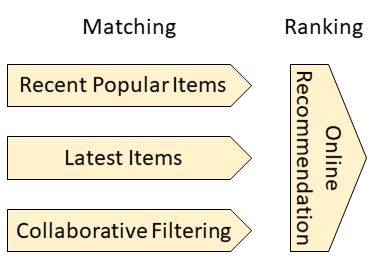

# 推荐原理

推荐由两阶段构成：召回和排序。推荐系统中的物品数量通常非常庞大，如果对全体物料进行排序是不现实的。因此需要召回阶段从物料库中筛选出一些物品，再由排序模型结合物品标签进行更加精准的排序。

## 召回机制

目前系统了三种召回策略：最新物品、最近热门物品和协同过滤召回。实际上，召回策略不限于这三种，还可以是根据用户感兴趣的标签进行召回、召回和用户喜欢的物品相似的物品等等，欢迎在[issues](https://github.com/zhenghaoz/gorse/issues)中交流。

- **最新物品：** 直接将最新物品加入排序过程，这样可以给予新物品曝光机会。

- **最近热门物品：** 用户喜欢热门物品的可能性比较大，但是需要设置时间限制避免推荐“过时”的热门。

- **协同过滤召回：** 使用协同过滤推荐算法从全体物料库中筛选召回物品。由于协同过滤不使用物品标签，因此计算量较小，适合召回场景。系统中实现了BPR、ALS和CCD这三种协同过滤推荐算法。

| 模型 | 论文                                                         |
| ---- | ------------------------------------------------------------ |
| ALS  | Hu, Yifan, Yehuda Koren, and Chris Volinsky. "Collaborative filtering for implicit feedback datasets." *2008 Eighth IEEE International Conference on Data Mining*. Ieee, 2008. |
| BPR  | Rendle, Steffen, et al. "BPR: Bayesian personalized ranking from implicit feedback." arXiv preprint arXiv:1205.2618 (2012). |
| CCD | He, Xiangnan, et al. "Fast matrix factorization for online recommendation with implicit feedback." Proceedings of the 39th International ACM SIGIR conference on Research and Development in Information Retrieval. 2016. |

## 排序机制

排序模型会考虑物品的标签信息，尤其对于新物品来说，标签是决定是否将新物品推送给用户的依据。本系统的排序模型选择了因子分解机：

| 模型 | 论文 |
| - | - |
| FM | Rendle, Steffen. "Factorization machines." *2010 IEEE International Conference on Data Mining*. IEEE, 2010. |
