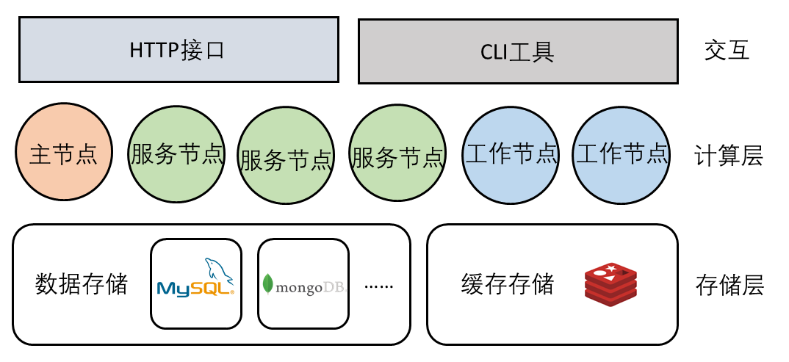
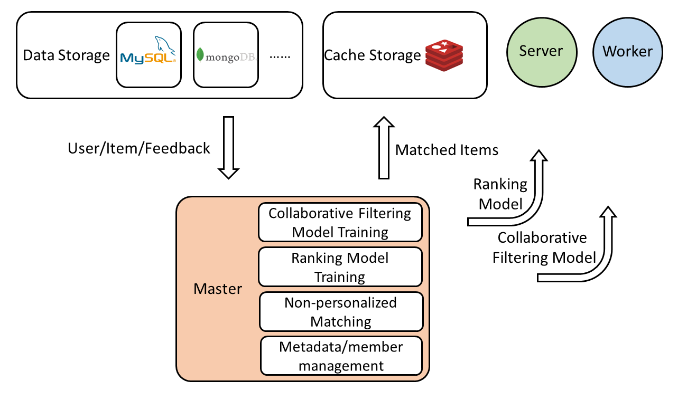
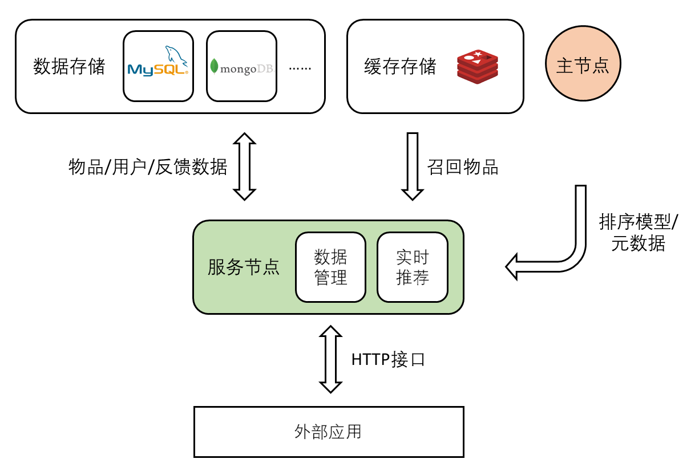
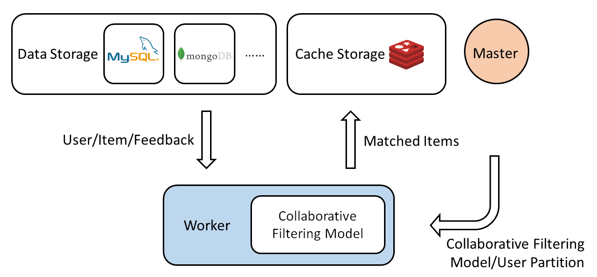

# 系统架构

本章会介绍数据存储和缓存存储的设计，以及主节点、服务节点和工作节点的分工合作。HTTP接口和CLI工具的使用可以参考[接口介绍](ch02-03-api.md)和[命令介绍](ch02-02-command.md)。

## 数据存储

数据存储由三张表构成（在MongoDB中就是三个集合）：物品库、用户库和交互记录库。

- **物品库**

| 字段名称 | 类型 | 作用 |
|-|-|-|
| `item_id` | 字符串 | 物品编号 |
| `time_stamp` | 时间 | 物品更新日期 |
| `labels` | 字符串数组 | 物品标签 |

- **用户库**

| 字段名称 | 类型 | 作用 |
|-|-|-|
| `user_id` | 字符串 | 用户编号 |
| `labels` | 字符串数组 | 用户标签 |

- **反馈记录库**

| 字段名称 | 类型 | 作用 |
|-|-|-|
| `feedback_type` | 字符串 | 反馈类型 |
| `user_id` | 字符串 | 用户编号 |
| `item_id` | 字符串 | 物品编号 |
| `time_stamp` | 时间 | 反馈时间 |

所有的操作都在这三张表（三个集合）上进行，必要的时候借助索引加快速度。`feedback_type`指定了反馈类型：例如B站的点赞、收藏、投币是不同的反馈类型。在插入反馈的时候，会遇到相关的用户或者物品在用户库和物品库中不存在，这个时候`auto_insert_user`和`auto_insert_item`就可以控制插入行为，可以选择自动插入用户或者物品，也可以选择放弃插入反馈。

## 缓存存储

缓存数据库存储键-字符串和键-列表两者类型的键值对。键由两部分组成：前缀和名称，在Redis实现中，前缀和名称会拼接成为最终的键。由于所有对缓存的操作都是点查询，因此缓存存储很容易就可以扩展成分布式的形式。

## 主节点

主节点主要负责以下工作：

- **元数据管理：** 主要管理系统配置和集群成员，集群节点心跳超时时间为`cluster_meta_timeout`秒。
- **非个性化召回：** 搜集最新物品以及最近热门物品，更新频率由`update_period`确定。
- **协同过滤模型训练：** 每间隔`fit_period`分钟训练协同过滤模型，供工作节点使用。
- **排序模型训练：** 每间隔`fit_period`分钟训练排序模型，供服务节点使用。

## 服务节点

服务节点主要提供两个功能：

- **暴露HTTP接口：** 用户/物品/反馈的读写都通过HTTP请求的形式完成，服务节点接收HTTP请求后对数据库进行操作，然后返回HTTP响应。
- **进行实时推荐：** 此时服务节点从缓存数据库读取召回物品，然后去除重复物品和用户查看过的物品，从数据库获取物品和用户特征之后将召回物品进行排序，然后将排序前`n`个物品返回。服务节点需要在后台不断检查更新排序模型，从而达到最好的推荐准确率。

## 工作节点

工作节点的任务更加简单一些——就是为用户生成个性化的召回物品集合。连接上主节点之后，工作节点会不断检查更新协同过滤模型。每隔一段时间（这个时间为`predict_period`）拉取集群中的工作节点地址计算出自己负责的用户标签范围，然后为负责的用户范围生成召回无物品写入到缓存数据库中。
