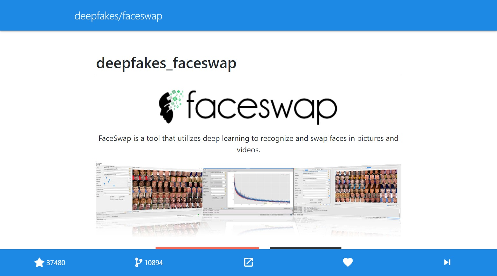

# GitRec, The Live Demo

[GitRec](https://gitrec.gorse.io/), the live demo, is developed to demonstrate the usage of the Gorse recommender system engine. A user logins in via GitHub OAuth, then repositories starred by this user before being imported to Gorse. Gorse recommends repositories to this user based on starred repositories. When this user saw a recommended repository, he or she can press ❤️ to tell GitRec that he or she like this recommendation and press ⏯️ to skip the current recommendation.



## Design

<center></center>

- **Import new repositories**: The trending crawler crawls trending repositories and inserts them into Gorse as new items. Since there are a huge number of repositories in GitHub, it's impossible to add all of them into GitRec. So, only trending repositories are imported.
- **Import user starred repositories**: The user starred crawler crawls user starred repositories and inserts them into Gorse as new feedback typed `star` when a new user signed in.
- **Recommendation and feedbacks**: GitRec web service pulls recommendations from Gorse and shows them to users. When a user press ❤️, the `like` feedback type will be inserted to Gorse. When ⏯️ pressed, `view` feedback type will be inserted to Gorse.

## Configuration

In GitRec, there are three types of feedbacks: `read`, `star` and `like`. `read` is the feedback type for reading events (a user skip a recommended repository). `like` is the feedback type for user press ❤️. `star` is the feedback type for user starred repositories. Since `star` events don't happen in GitRec, it won't be added to `click_feedback_types`.

```toml
# feedback type for positive event
positive_feedback_types = ["star","like"]

# feedback type for click event
click_feedback_types = ["like"]

# feedback type for read event
read_feedback_type = "read"
```

Other settings are the same as [docker/config.toml](https://github.com/zhenghaoz/gorse/blob/master/docker/config.toml).

## Implemenetation

This project consists of frontend, backend, and crawlers. In this section, only these codes that interact with Gorse are introduced. Other codes are available in the [GitRec repository](https://github.com/zhenghaoz/gitrec).

1. First thing is to wrap Gorse API as a python module. It sends HTTP requests and handles responses using `requests`.

    ```python
    from collections import namedtuple
    from datetime import datetime
    from typing import List

    import requests

    Success = namedtuple("Success", ["RowAffected"])


    class GorseException(BaseException):
        def __init__(self, status_code: int, message: str):
            self.status_code = status_code
            self.message = message


    class Gorse:
        def __init__(self, entry_point):
            self.entry_point = entry_point

        def insert_feedback(
            self, feedback_type: str, user_id: str, item_id: str
        ) -> Success:
            r = requests.post(
                self.entry_point + "/api/feedback",
                json=[
                    {
                        "FeedbackType": feedback_type,
                        "UserId": user_id,
                        "ItemId": item_id,
                        "Timestamp": datetime.now().isoformat(),
                    }
                ],
            )
            if r.status_code == 200:
                return r.json()
            raise GorseException(r.status_code, r.text)

        def get_recommend(self, user_id: str, n: int = 1) -> List[str]:
            r = requests.get(self.entry_point + "/api/recommend/%s?n=%d" % (user_id, n))
            if r.status_code == 200:
                return r.json()
            raise GorseException(r.status_code, r.text)

        def insert_feedbacks(self, feedbacks) -> Success:
            r = requests.post(self.entry_point + "/api/feedback", json=feedbacks)
            if r.status_code == 200:
                return r.json()
            raise GorseException(r.status_code, r.text)

        def insert_item(self, item) -> List[str]:
            r = requests.post(self.entry_point + "/api/item", json=item)
            if r.status_code == 200:
                return r.json()
            raise GorseException(r.status_code, r.text)
    ```

2. In the code of trending crawler, insert trending repositories as new items.

    ```python
    if __name__ == "__main__":
        trending_repos = get_trending()
        for trending_repo in trending_repos:
            gorse_client.insert_item(get_repo_info(trending_repo))
    ```

3. In the code of starred repositories crawler, insert user starred repositories as `star` feedbacks.

    ```python
    @app.task
    def pull(token: str):
        g = GraphQLGitHub(token)
        stars = g.get_viewer_starred()
        gorse_client.insert_feedbacks(stars)
    ```

4. In the code of the web service backend, pull recommendations from Gorse, insert `like` and `read` into Gorse.

    ```python
    @app.route("/api/repo")
    def get_repo():
        repo_id = gorse_client.get_recommend(session["user_id"])[0]
        full_name = repo_id.replace(":", "/")
        github_client = Github(github.token["access_token"])
        repo = github_client.get_repo(full_name)
        # ...


    @app.route("/api/like/<repo_name>")
    def like_repo(repo_name: str):
        try:
            return gorse_client.insert_feedback("like", session["user_id"], repo_name)
        except gorse.GorseException as e:
            return Response(e.message, status=e.status_code)


    @app.route("/api/read/<repo_name>")
    def read_repo(repo_name: str):
        try:
            return gorse_client.insert_feedback("read", session["user_id"], repo_name)
        except gorse.GorseException as e:
            return Response(e.message, status=e.status_code)
    ```
