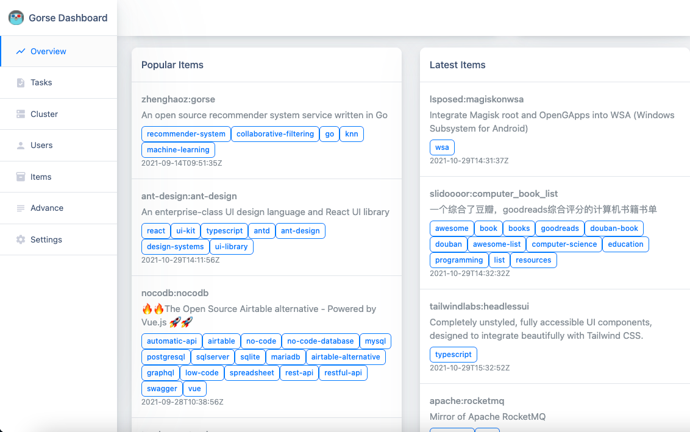
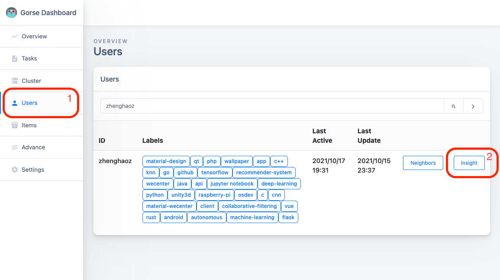
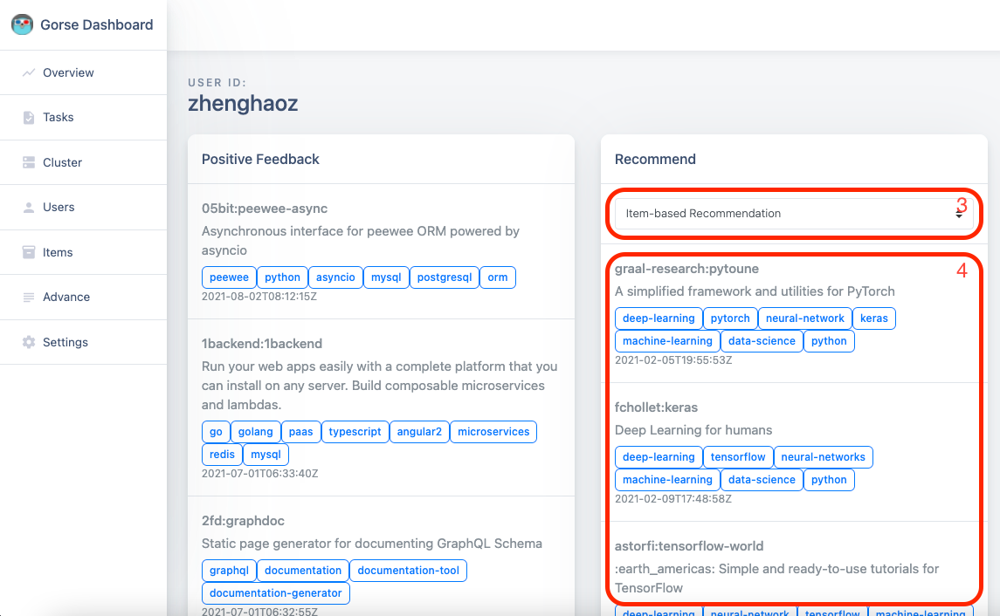

# Recommendation Strategy

Gorse recommender system implements different types of recommenders, both non-personalized and personalized. In fact, no single recommender is a panacea, and only a combination of them can be used to achieve the best recommendation results.

## Recommenders

First, this section introduces the various types of recommenders in Gorse, each of which has its pros and cons.

### Latest Recommender

Latest recommender shows the latest items to users according to timestamps, which allows new item to be exposed to users in time. However, the downside of latest recommender is that it does not consider the quality (or popularity) of items. To enable latest recommender in Gorse, you need to set timestamp information for the items. Without timestamps, Gorse will not generate a list of latest items.

```go
type Item struct {
    ItemId    string
    Timestamp time.Time // The timestamp is required.
    Labels    []string
    Comment   string
}
```

### Popular Recommender

Popular recommender shows the recent popular items to users, most typically Twitter trending. In Gorse, the `popular_window` in the configuration file corresponds to the window of popular items, the following example is to recommend popular items within one year (a bit too long).

```toml
popular_window = 365
```

Popular recommender is obviously not suitable to be used alone, otherwise it would result in new items not being exposed. Many sites display content with a combination of popular and latest recommendations, such as calculating a score based on popularity and freshness, and finally sorting by score.

### Item-based Similarity Recommender

In some scenarios, users like specific types of items, for example, gamers like to solve puzzles, or users of a video platform like to watch dancing girls. Based on the user's history and the similarity between items, item-based similarity recommender recommends items to users. The critical step of item-based similarity recommender is to calculate the similarity between items.

Gorse calculates item similarity in three modes, which can be set in the configuration file.

- **Similarity:** Calculates similarity based on label overlap between items.
- **Related:** Calculates similarity based on user overlap between items.
- **Automatic:** Prefer to use labels to calculate similarity, if there are no labels then use users to calculate similarity.

```toml
# The type of neighbors for items. There are three types:
#   similar: Neighbors are found by number of common labels.
#   related: Neighbors are found by number of common users.
#   auto: If a item have labels, neighbors are found by number of common labels.
#         If this item have no labels, neighbors are found by number of common users.
# The default values is "auto".
item_neighbor_type = "similar"
```

It is recommended to choose `similar` or `auto` because item-based similarity recommender using `related` recommends similarly to collaborative filtering recommenders. The advantage of item-based similarity (labels-based) recommender is that it can quickly recommend a new item to users who are interested in such items based on the labels. Of course, this recommender requires accurate labels for the items, and invalid labels are counterproductive.

### User-based Similarity Recommender

There are also common preferences among similar users. For example, students majoring in computer science usually buy books about computer science, and elders like to buy health care products.

Gorse calculates the similarity between users in three modes, which can be set in the configuration file.

- **Similarity:** Calculates similarity based on label overlap between users.
- **Related:** Calculates similarity based on historical item overlap between users.
- **Automatic:** Prioritizes the use of user labels, if there are no labels then the similarity is calculated using historical items.

```toml
# The type of neighbors for users. There are three types:
#   similar: Neighbors are found by number of common labels.
#   related: Neighbors are found by number of common liked items.
#   auto: If a user have labels, neighbors are found by number of common labels.
#         If this user have no labels, neighbors are found by number of common liked items.
# The default values is "auto".
user_neighbor_type = "similar"
```

It is recommended to choose `similar` or `auto` because user-based Similarity Recommender using `related` is similar to collaborative filtering recommender. The recommender is friendly to new users. With user labels, recommendations can be generated based on similar users' preferences even if the user does not have any history.

### Collaborative Filtering Recommender

Recommenders based on similar items and similar users require that the recommended items need to be linked with similar users or historical items of the recommended user, which limits the scope of recommended items searching. The collaborative filtering recommender in Gorse uses matrix factorization to recommend items. The training algorithm maps users and items to embedding vectors in a high-dimensional space, and the user's preference for an item is the dot product of the user embedding vector and the item embedding vector. However, the disadvantage of collaborative filtering recommender is that it cannot utilize the label information of users and items, and it cannot handle new users and new items.

### Click-through Rate Prediction

Is there a recommender that combines advantages of similarity recommender and collaborative filtering recommender? Then it is the click-through rate prediction model. The click-through rate prediction model in Gorse is a factorization machine that generates embedding vectors for each user label and item label in addition to embedding vectors for each user and item. Although the factorization machine model is effective, it is not generally used as a recommender for collecting recommended items over all items. Compared with collaborative filtering recommender and similarity recommender, its computational complexity is large. Gorse's click-through prediction model is used to fuse and rank the results of the above recommenders.

The original meaning of "click-through rate prediction" is to predict the probability that users will click on the recommended content or ads, but it should be noted that the click-through rate prediction in Gorse refers more to the probability that users will give positive feedback to the recommended results. For example, suppose we set in Gorse that positive feedback means the user has watched 50% of the video, then the "click-through rate" is the probability that the user has watched more than 50% of the video.

## Recommendation Strategy

Individual recommenders cannot perform the recommendation task well, and multiple recommenders need to be combined. Gorse provides a workflow for generating recommendation results, under which we can draft recommendation strategies that are suitable for specific scenarios. The recommendation process consists of two main components: offline recommendation and online recommendation. The offline recommendation collects recommendations for each user from the full set of items and caches them in Redis. The online recommendation pulls the cached recommendation results, then removes the read content from the recommendation results, and if the cached recommendation results are exhausted, then the recommendation content is generated in real time using the fallback recommenders.

### Offline Strategy

Offline recommendation consists of three phases.

- **Matching:** Use different full-set recommenders to collect recommended items from all items. There are five types of full-set recommenders: popular recommender, latest recommender, item-based similarity recommender, user based similarity recommender and collaborative filtering recommender, which can be set on or off in the configuration file.
- **Ranking:** Use the factorization machine model to rank the items collected by the matching phase, currently you can also turn off the click-through rate prediction in the configuration and use random merge.
- **Exploration:** Recommend content based on user history can be a good idea for users, but it also limits the possibility of users seeing more diverse content. It is also a kind of "exploration and exploitation" problem, where exploitation refers to recommending content based on users' historical behavior, while exploration refers to exposing users to more content beyond their awareness. One of the easiest ways to expose users to content beyond the information cocoon is to insert random items into the recommendation list, and Gorse can be configured to randomly insert the newest or recent popular items into the recommendation list, with their proportion set in the configuration file.

```toml
# Enable latest recommendation during offline recommendation. The default values is false.
enable_latest_recommend = true
# Enable popular recommendation during offline recommendation. The default values is false.
enable_popular_recommend = false
# Enable user-based similarity recommendation during offline recommendation. The default values is false.
enable_user_based_recommend = true
# Enable item-based similarity recommendation during offline recommendation. The default values is false.
enable_item_based_recommend = false
# Enable collaborative filtering recommendation during offline recommendation. The default values is true.
enable_collaborative_recommend = true
# Enable click-though rate prediction during offline recommendation. Otherwise, results from multi-way recommendation
# would be merged randomly. The default values is true.
enable_click_through_prediction = true
# The explore recommendation method is used to inject popular items or latest items into recommended result:
#   popular: Recommend popular items to cold-start users.
#   latest: Recommend latest items to cold-start users.
# Recommenders are used in order. The default values is { popular = 0.0, latest = 0.0 }.
explore_recommend = { popular = 0.1, latest = 0.2 }
```

Perhaps the introduction of various recommenders is not intuitive enough, you can actually preview the recommendation results in the dashboard. The popular items and the latest items can be seen on the landing page of dashboard.



The results of offline recommendation, item-based similarity recommendation, user-based similarity recommendation and collaborative filtering recommendation can be viewed on the user page by clicking *Insight*:

- Click *Users* in the navigation bar
- Click *Insight* in the user row

You can choose to show offline recommendation results, similarity item recommendation, similar user recommendation and collaborative filtering recommendation results from the drop-down menu on the right side





Since Gorse does not yet offer A/B testing, the preview is needed to sensitively draft a recommendation strategy.

### Online Strategy

Online recommendations have two tasks.

- **Remove reads:** The read items in the recommendation result cache need to be removed.
- **Fallback recommendation:** There might be a situation that the cached recommendation results are drain out but new offline recommendations haven't been generated, then the fallback recommenders are needed to generate the recommendation content in real time. The fallback recommenders can be configured in the configuration file with priority from head to tail, and if the front recommender is no longer able to generate recommendation, then continue to try the backward recommender.

```toml
# The fallback recommendation method for cold-start users:
#   item_based: Recommend similar items to cold-start users.
#   popular: Recommend popular items to cold-start users.
#   latest: Recommend latest items to cold-start users.
# The default values is ["latest"].
fallback_recommend = ["item_based", "latest"]
```
