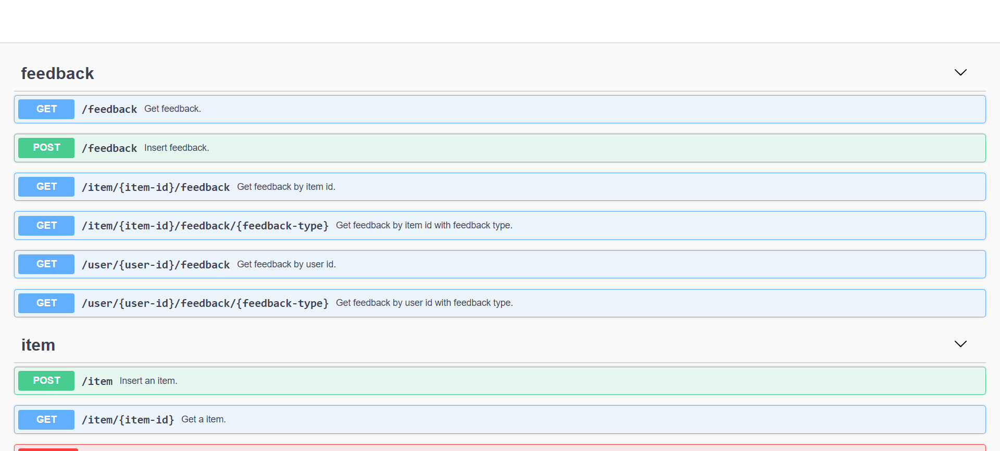

# RESTful APIs

The server node provides RESTful APIs with documents under the `apidocs` path. If the address of the server's RESTful API service is `127.0.0.1:8087`, then the URL of the document is [`http://127.0.0.1:8087/apidocs`](http://127.0.0.1:8087/apidocs).

## Data Interfaces

There are operations on user/item/feedback data.

| Method | URL | Description |
|-|-|-|
| POST | /user | Insert a user |
| DELETE | /user | Delete a user and all associated feedback |
| GET | /user/{user-id} | Get a user |
| GET | /users | Get all users |
| POST | /item | Insert an item |
| DELETE | /item | Delete an item |
| GET | /item/{item-id} | Get an item and delete all related feedback |
| GET | /items | Get all items |
| POST | /feedback | Batch insert feedbacks |
| GET | /feedback | Get all feedbacks |
| GET | /user/{user-id}/feedback/{feedback-type} | Get user feedback |
| GET | /item/{item-id}/feedback/{feedback-type} | Get item feedback |

## Caching APIs

Get matched items.

| Method | URL | Description |
|-|-|-|
| GET | /latest | Get the latest items |
| GET | /popular | Get recent popular items |
| GET | /neighbors/{item-id} | Get similar items |
| GET | /cf/{user-id} | Get collaborative filtering recommended items |

## Recommendation APIs

Online recommendations are generated by the server node in real-time.

| Method | URL | Description |
|-|-|-|
| GET | /recommend/{user-id} | Online recommendations |
