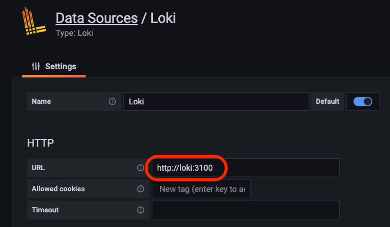
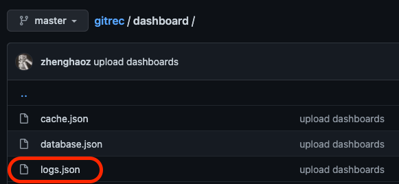

# Log Monitoring

The mainstream log monitoring solutions are ELK and Loki. Loki is chosen in this section because it is more lightweight compared to ELK. The log collection and monitoring process is as follows.

- Gorse nodes writes the logs to a file.
- Promtail reads the logs from the file and pushes them to Loki.
- Grafana reads the logs from Loki for visualization.

First, you need to set each node to write logs to a file in `docker-compose.yml`, as well as add Promtail, Loki and Grafana.

```yaml
version: "3"
services:
  worker:
    image: zhenghaoz/gorse-worker
    restart: unless-stopped
    ports:
      - 8089:8089
    command: >
      --master-host master --master-port 8086 --http-host 0.0.0.0 --http-port 8089
      --log-path /var/log/gorse/worker.log --cache-path /var/lib/gorse/worker_cache.data
    volumes:
      - ./var/log/gorse:/var/log/gorse
      - ./var/lib/gorse:/var/lib/gorse

  server:
    image: zhenghaoz/gorse-server
    restart: unless-stopped
    ports:
      - 8087:8087
    command: >
      --master-host master --master-port 8086 --http-host 0.0.0.0 --http-port 8087
      --log-path /var/log/gorse/server.log --cache-path /var/lib/gorse/server_cache.data
    volumes:
      - ./var/log/gorse:/var/log/gorse
      - ./var/lib/gorse:/var/lib/gorse

  master:
    image: zhenghaoz/gorse-master
    restart: unless-stopped
    ports:
      - 8086:8086
      - 8088:8088
    command: -c /etc/gorse/config.toml --log-path /var/log/gorse/master.log --cache-path /var/lib/gorse/master_cache.data
    volumes:
      - ./etc/gorse/config.toml:/etc/gorse/config.toml
      - ./var/log/gorse:/var/log/gorse
      - ./var/lib/gorse:/var/lib/gorse

  grafana:
    image: grafana/grafana
    restart: unless-stopped
    ports:
      - 3000:3000
    volumes:
      - grafana-storage:/var/lib/grafana

  loki:
    image: grafana/loki
    restart: unless-stopped
    command: -config.file=/etc/loki/local-config.yaml
    ports:
      - 3100:3100
    volumes:
      - ./etc/loki/local-config.yaml:/etc/loki/local-config.yaml

  promtail:
    image: grafana/promtail
    restart: unless-stopped
    command: -config.file=/etc/promtail/config.yml
    ports:
      - 9080:9080
    volumes:
      - ./var/log/gorse:/var/log/gorse
      - ./etc/promtail/config.yml:/etc/promtail/config.yml

# ...

volumes:
  grafana-storage:
```

Loki's configuration file `local-config.yaml` is as follows.

```yaml
auth_enabled: false

server:
  http_listen_port: 3100

ingester:
  lifecycler:
    address: 127.0.0.1
    ring:
      kvstore:
        store: inmemory
      replication_factor: 1
    final_sleep: 0s
  chunk_idle_period: 5m
  chunk_retain_period: 30s

schema_config:
  configs:
    - from: 2020-05-15
      store: boltdb
      object_store: filesystem
      schema: v11
      index:
        prefix: index_
        period: 168h

storage_config:
  boltdb:
    directory: /tmp/loki/index

  filesystem:
    directory: /tmp/loki/chunks

limits_config:
  enforce_metric_name: false
  reject_old_samples: true
  reject_old_samples_max_age: 168h
```

The configuration file for Promtail is as follows.

```yaml
server:
  http_listen_port: 9080
  grpc_listen_port: 0

positions:
  filename: /var/log/positions.yaml # This location needs to be writeable by Promtail.

clients:
  - url: http://loki:3100/loki/api/v1/push

scrape_configs:
  - job_name: system
    static_configs:
    - targets:
        - localhost
      labels:
        job: master
        __path__: /var/log/gorse/master.log
    - targets:
        - localhost
      labels:
        job: worker
        __path__: /var/log/gorse/worker.log
    - targets:
        - localhost
      labels:
        job: server
        __path__: /var/log/gorse/server.log
    pipeline_stages:
    - json:
        expressions:
          level: level
    - labels:
        level:
```

After deploying `docker-compose.yml`, login to Grafana and add Loki as a data source:



Finally, import the logs dashboard provided in the demo project GitRec to monitor warnings, errors, and fatal logs in the recommender system in real time.



The logs dashboard filters warning, error, and fatal logs.

- **Warning:** Events affect the outcome of the recommender system, but the system has a strategy to deal with them.
- **Error:** Events affect the function of the system, but the system is still able to continue.
- **Fatal:** Events prevent the system from continuing to run.

Log entries such as database temporarily connection lost, network temporarily timeout, etc. are expected. If an error log is generated that is not expected, welcome to paste it on [GitHub Issues](https://github.com/zhenghaoz/gorse/issues).


