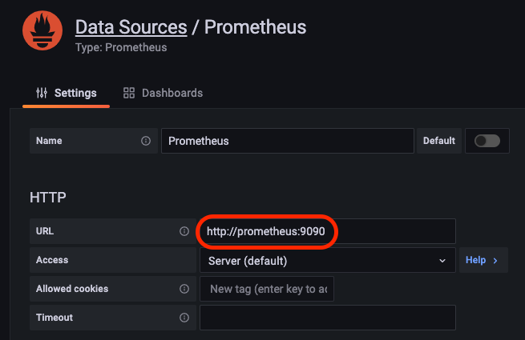
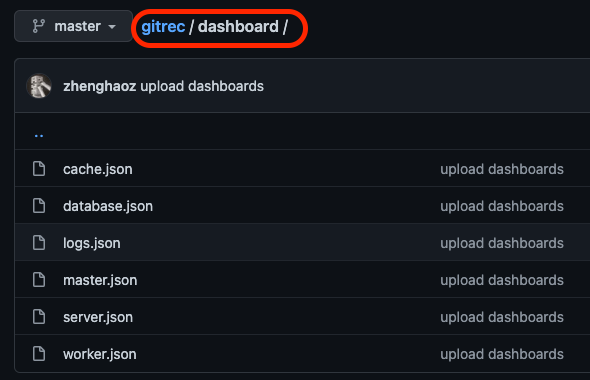
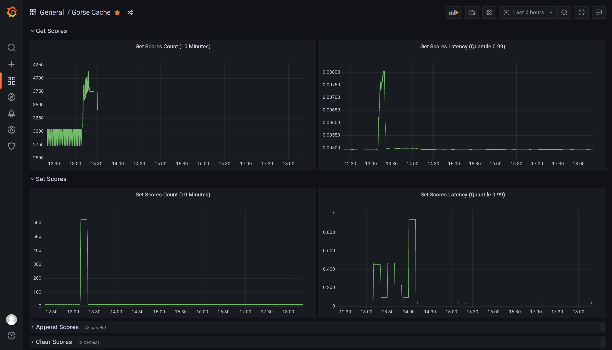

# Metrics Monitoring

Gorse nodes exports Prometheus metrics, and Prometheus can scrape real-time metrics via HTTP from each node. The default HTTP port for worker nodes is `8089`, the default HTTP port for server nodes is `8087`, and the default HTTP port for master nodes is `8088`. The HTTP port for worker and server nodes can be set via the command line option `--http-port`.

The Prometheus configuration file for scraping Gorse metrics is as follows.

```yaml
scrape_configs:
  - job_name:       'gorse'
    scrape_interval: 10s
    static_configs:
      - targets: ['worker:8089', 'server:8087', 'master:8088']
```

`scrape_interval` is the scrape frequency and `targets` is the address to scrape the metrics. Since the above configuration file is used for Docker Compose deployments, the hostname is used instead of the IP address. Next, add an instance of Prometheus to `docker-compose.yml`, mount the above configuration file to the default configuration file path `/etc/prometheus/prometheus.yml`.

```yaml
version: "3"
services:

  prometheus:
    image: prom/prometheus
    restart: unless-stopped
    ports:
      - 9090:9090
    volumes:
      - ./etc/prometheus/prometheus.yml:/etc/prometheus/prometheus.yml
```

After Prometheus started, add Prometheus as a data source in Grafana.



Finally, import dashboards provided in the demo project GitRec to monitor the count and latency of each service call on the database, cache, worker node, server node, and master node in real time.



The left side of the dashboard shows the count of calls per ten minutes, while the right side shows the call latency within 99%.


