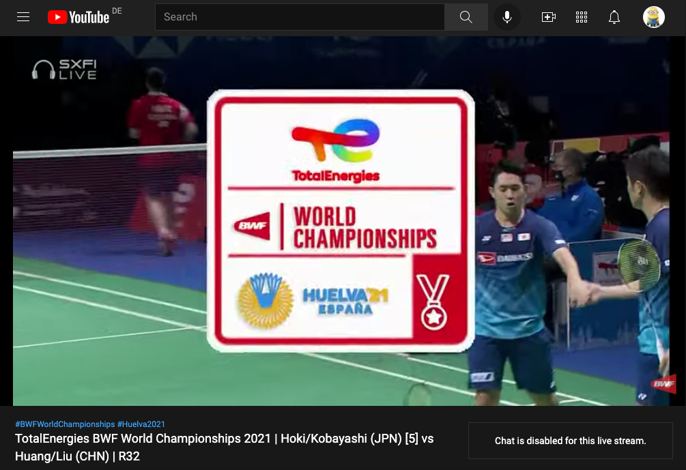

# Item Management

Items are the main characters of the recommender system. This section will introduce how to manage items in Gorse, including controlling the visibility of items, describing items to the recommender system, etc.

## Item Properties

An item consists of 6 fields:

```go
type Item struct {
	ItemId     string
	IsHidden   bool
	Categories []string
	Timestamp  time.Time
	Labels     []string
	Comment    string
}
```

- `ItemId` is the unique identifier of the item and cannot contain a slash "/" because of conflicts with the URL definition of the RESTful API.
- `IsHidden` determines whether the item is hidden, after setting true, the item will no longer appear in the recommendation results.
- `Categories` is the categories to which the item belongs, the item is recommended under these categories.
- `Timestamp` is the timestamp of the item, which is used to determine the freshness of the item.
- `Labels` is the item's label information, which is used to describe the item's characteristics to the recommender system.
- `Comment` is the item's comment information, which helps to browse items and recommendation results in the dashboard.

## Item Management

With the help of item fields, items can be managed flexibly.

### Hide Items

In many cases, items in the history are not available for recommendation to other users, e.g.
- If the item is sold out, it can't be recommended to other users.
- If the item is legally risky, it cannot continue to be recommended to other users either.

In Gorse, items can be taken down by setting `IsHidden` to `true` for the item via the RESTful API. The recommendation algorithm can use the item during training, but the item will no longer be recommended to other users. Setting `IsHidden` to `true` takes effect immediately, but setting it to `false` resumes item recommendations after the `refresh_recommend_period` has expired.

### Multi-Categories Recommendation

Multi-categories recommendations are common, take YouTube for example, where multiple recommendation categories are provided on the homepage.


Multiple categories can be distinguished by topics such as food, travel, etc., or by forms, e.g. live, short and long videos. Items will definitely appear in the global recommendation stream, and in addition the `Categories` field determines which recommendation categories the items should appear in. For each recommendation API, there are a global version and category version:

| METHOD |  URL |   DESCRIPTION |
|-|-|-|
| `GET` | `/api/latest` | Get latest items. |
| `GET` | `/api/latest/{category}` | Get latest items in specified category. |
| `GET` | `/api/popular` | Get popular items. |
| `GET` | `/api/popular/{category}` | Get popular items in specified category. |
| `GET` | `/api/recommend/{user-id}` | Get recommendation for user. |
| `GET` | `/api/recommend/{user-id}/{category}` | Get recommendation for user in specified category. |
| `GET` | `/api/item/{item-id}/neighbors` | Get neighbors of a item. |
| `GET` | `/api/item/{item-id}/neighbors/{category}` | Get neighbors of a item in specified category. |

For example, for a live badminton match, you can set its `Categories` to "Live" and "Sports". In this way, in addition to the default recommendation stream, the user can find the live stream in the "Live" and "Sports" recommendation categories.



Note that multi-column recommendations will consume more Redis cache space.

### Using Labels to Describe Items

If only the item ID is available, the recommender system has no knowledge of the item's content, which requires labels to help the recommender system understand the item.

- **User-Generated Label**: Human-supplied labels are generally the most accurate and can be added by editors or users. For example, for a game, editors can add publisher and genres as labels, and users can add topics about the game as labels.
- **Automatic Label Extraction**: Unfortunately, in many cases, items do not have ready-made labels, so it is necessary to use machine learning to automatically generate labels for items.
  - **Image Classification**: The class of image is used as a label, for example, to classify whether the image is a girl, a boy, a cat or a dog.
  - **Object Detection**: Detect the objects contained in the image as labels, e.g. detecting the image as having a girl with a cat.
  - **Keyword Extraction**: Extract the keywords of the text, e.g. an article talks about deep learning based recommender systems, the keywords are deep learning and recommender system.
  - **Text Classification**: Classify the content of a article, for example, to determine whether a tweet is confiding, dating or job hunting.

Generating high-quality labels for items is a difficult task, and low-quality labels might harm the accuracy of the recommender system.
