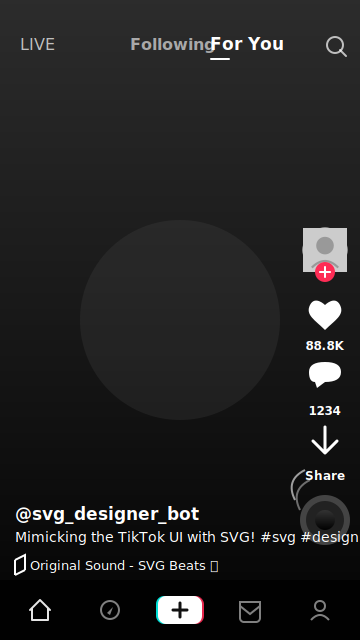
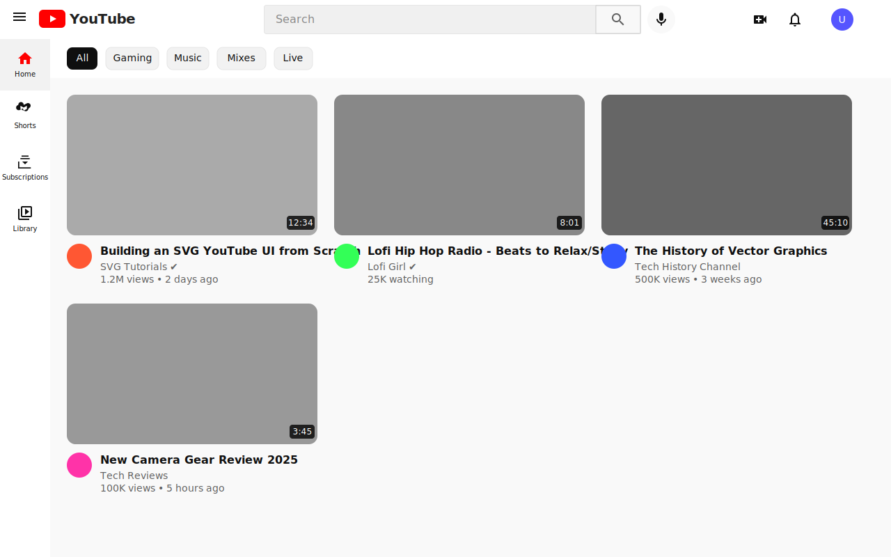

# Data Source

There are three kinds of data collections in Gorse: users, items, and feedback.

## Users

A user consists of a user ID, labels, and comment:

```go
type User struct {
    UserId    string
    Labels    any
    Comment   string
}
```
- `UserId` is the unique identifier of the user and cannot contain a slash "/" because of conflicts with the URL definition of the RESTful APIs.
- `Labels` is the user's label information in JSON format, which is used to describe the user's characteristics to the recommender system. The user labels can be empty, but these labels help to improve recommendations.
- `Comment` is the user's comment information, which helps to browse users in the dashboard.

## Item

An item consists of 6 fields:

```go
type Item struct {
	ItemId     string
	IsHidden   bool
	Categories []string
	Timestamp  time.Time
	Labels     any
	Comment    string
}
```

- `ItemId` is the unique identifier of the item and cannot contain a slash "/" because of conflicts with the URL definition of the RESTful APIs.
- `IsHidden` indicates whether the item is hidden from recommendations.
- `Categories` is a list of categories the item belongs to, which is used for filtering items in recommendations.
- `Timestamp` is the time when the item is added to the recommender system, which is used to determine the freshness of the item.
- `Labels` is the label information of the item in JSON format, which is used to describe the content of the item to the recommender system. The item labels can be empty, but these labels help to improve recommendations.
- `Comment` is the comment information of the item, which helps to browse items in the dashboard.

### Hide Items

In many cases, items in the history are not available for recommendation to other users, e.g.
- If the item is sold out, it can't be recommended to other users.
- If the item is legally risky, it cannot continue to be recommended to other users either.

In Gorse, items can be taken down by setting `IsHidden` to `true` for the item via the RESTful API. The recommendation algorithm can use the item during training, but the item will no longer be recommended to other users. Setting `IsHidden` to `true` takes effect immediately, but setting it to `false` resumes item recommendations after the `refresh_recommend_period` has expired.

### Describe Items via Labels

If only the item ID is available, the recommender system does not know the item's content, which requires labels to help the recommender system understand the item.

- **User-Generated Label**: Human-supplied labels are generally the most accurate and can be added by editors or users. For example, for a game, editors can add the publisher and genres as labels, and users can add topics about the game as labels.
- **Embedding Vectors**: Embedding vectors are dense vector representations of text, images, and other unstructured data. Embedding vectors can be generated using pre-trained models such as [EmbeddingGemma](https://ai.google.dev/gemma/docs/embeddinggemma) for text.

::: warning
Keyword extraction or other automatic label extraction methods have been deprecated because they do not perform as well as embedding vectors.
:::

## Feedback

A feedback consists of user ID, item ID, feedback type, feedback value, and feedback timestamp, where the triad of user ID, item ID, and feedback type is required to be unique in the database.

```go
type Feedback struct {
    FeedbackType string
    UserId       string
    ItemId       string
    Value        float64
    Timestamp    time.Time
}
```

Feedback represents events that happened between users and items, which can be positive or negative. For example, sharing and liking are the user's positive feedback to an item. If the user does not have further positive feedback after reading, the user's feedback on the item is considered negative. If the user views the item, read feedback will be recorded. Then, if the user gives positive feedback to the item, the read feedback will be overwritten by the positive feedback. Conversely, if the user does not give positive feedback, then the read feedback is considered negative feedback.

The feedback value is used to represent the strength of the feedback. For example, a 5-star rating system can be represented by feedback values from 1 to 5. If the feedback value is not available, it can be set to 0.

### Positive and Read Feedback

Before inserting feedback into the Gorse recommender system, it is necessary to define which of the user's behaviors are positive feedback and which are read feedback. Read feedback is relatively easy to define, as it can be recorded as read feedback when a user has seen the recommended item. However, the definition of positive feedback depends more on the specific scenario. For TikTok, users can be considered as positive feedback if they “like” or “share” the current video. For YouTube, users can be considered as positive feedback if they watch the video to a certain proportion of completion, “like“ the video, or "share" the video. To summarize, positive feedback and read feedback are defined by the following rules.

- **Read Feedback:** The user sees the item.
- **Positive feedback:** The user action that is expected to do by the service provider.

### Insert Feedback

There are two ways to insert feedback into the Gorse recommender system: inserting new feedback and updating existing feedback. Inserting new feedback is done via the `PUT /api/feedback` API, while updating existing feedback is done via the `POST /api/feedback` API. Both APIs accept a list of feedback in JSON format.

::: code-tabs

@tab:active POST

```bash
curl -X POST "http://localhost:8088/api/feedback" \
    -H "accept: application/json" \
    -H "Content-Type: application/json" \
    -d '[ { "FeedbackType": "read", "ItemId": "10086", "Value": 1, "Timestamp": "2021-10-24T06:42:20.207Z", "UserId": "jack" }]'
```

@tab PUT

```bash
curl -X PUT "http://localhost:8088/api/feedback" \
    -H "accept: application/json" \
    -H "Content-Type: application/json" \
    -d '[ { "FeedbackType": "read", "ItemId": "10086", "Value": 1, "Timestamp": "2021-10-24T06:42:20.207Z", "UserId": "jack" }]'
```

:::

`PUT /api/feedback` will overwrite existing feedback with the same user ID, item ID, and feedback type, while `POST /api/feedback` will only sum the feedback value to the existing feedback value. For example, if there is already a feedback record of `{ "FeedbackType": "read", "ItemId": "10086", "Value": 1, "Timestamp": "2021-10-24T06:42:20.207Z", "UserId": "jack" }` in the database, then inserting the same feedback via `PUT /api/feedback` will result in the feedback value being `1`, while inserting the same feedback via `POST /api/feedback` will result in the feedback value being `2`.

### Read Detection

Positive feedback can be easily detected when the user takes an action, such as clicking the "like" button. However, read feedback requires the application to detect when the user has "read" the item. There are two ways to detect read feedback: proactive read and automatic read.

#### Proactive Read

Positive feedback can be inserted into the recommender system when the user takes the action, while read feedback requires the application to detect the user's "read" behavior. The methods for displaying recommendations vary by application but can be generally grouped into two categories.

- **Full-screen mode:** The most typical application is TikTok, where the user is considered "read" when the full-screen content is shown to them. That is, the application can write a "read" feedback to the recommender system when the recommended content is shown to the user, and the read content will no longer be shown to the user.

::: center



:::

- **List mode:** The most typical application is YouTube, where the user is not considered "read" after looking at multiple videos in the list. When there are more than one videos, the user's attention is not able to browse the whole list. Moreover, if the read content is quickly discarded in the list mode, the recommended content is consumed too fast. Therefore, the best solution is to write a "read" feedback with a future timestamp to the recommender system when the item is presented to the user in the stream, and the "read" feedback will take effect when the time has reached the timestamp, and the read content will no longer be presented to the user.



#### Automatic Read

Proactively inserting read feedback into the recommender system requires the application to be able to accurately capture user browsing behavior. This task is easier for mobile applications but more difficult for web applications. To address this problem, Gorse's API for getting recommendation results provides two parameters: `write−back−type` and `write−back−delay`.

- **In full-screen mode:** Get a recommendation and write a "read" feedback, the recommendation will not appear again afterward.

```bash
curl -X GET "http://172.18.0.3:8087/api/recommend/zhenghaoz?write-back-type=read&n=1" \
    -H "accept: application/json" \
    -H "X-API-Key: 19260817"
```

- **In list mode:** Get 10 recommendations and write "read" feedback with timestamps of 10 minutes later. The 10 recommendations will not be discarded until after 10 minutes.

```bash
curl -X GET "http://172.18.0.3:8087/api/recommend/zhenghaoz?write-back-type=read&write-back-delay=10m&n=10" \
    -H "accept: application/json" \
    -H "X-API-Key: 19260817"
```

The `write−back−type` and `write−back−delay` parameters of the recommendation API provide a convenient way to insert read feedback, but of course, if you want the read feedback to be more accurate, it should be written to the recommender system by the application.

## Configuration

There are several configuration options related to data source in Gorse:

- `positive_feedback_types`: A list of feedback types that are considered positive feedback.
- `read_feedback_types`: A list of feedback types that are considered read feedback.
- `positive_feedback_ttl`: Time-to-live for positive feedback in days. After this period, positive feedback will be ignored in recommendations. Default value: `0` (no expiration).
- `item_ttl`: Time-to-live for items in days. After this period, items will be automatically hidden from recommendations. Default value: `0` (no expiration).

`positive_feedback_types` and `read_feedback_types` can be feedback type or feedback type with a value condition. Condition operators can be `>`, `>=`, `<`, `<=` , and `==`. For example, if the feedback type is "read" and the feedback value is 5, then "read>=3" is considered positive feedback, while "read<3" is considered read feedback.

TTL is used to automatically remove old feedback and items from the recommender system to ensure that recommendations remain fresh and relevant.

## Example

In the demo project [GitRec](https://gitrec.gorse.io/), the following configuration is used to define positive feedback as "star", "like", and "read" with a value greater than or equal to 3. Read feedback is defined as "read". Both positive feedback and items do not expire.

```toml
[recommend.data_source]
positive_feedback_types = ["star","like","read>=3"]
read_feedback_types = ["read"]
positive_feedback_ttl = 0
item_ttl = 0
```
