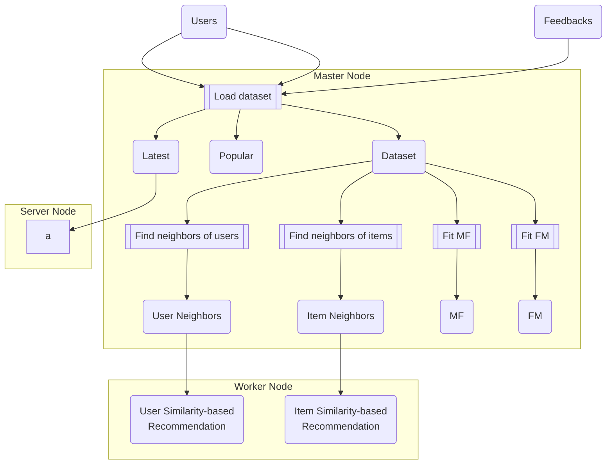

# How It Works

```mermaid
flowchart TD
    items(Users)-->load[[Load dataset]]
    items-->load
    feedback(Feedbacks)-->load
    subgraph Master Node
    load-->latest(Latest)
    load-->pop(Popular)
    load-->dataset(Dataset)
    dataset-->find_users[[Find neighbors of users]]
    find_users-->user_neighbors(User Neighbors)
    dataset-->find_items[[Find neighbors of items]]
    find_items-->item_neighbors(Item Neighbors)
    dataset-->fit_mf[[Fit MF]]
    fit_mf-->mf(MF)
    dataset-->fit_fm[[Fit FM]]
    fit_fm-->fm(FM)
    end
    subgraph Worker Node
    user_neighbors-->user_based(User Similarity-based\nRecommendation)
    item_neighbors-->item_based(Item Similarity-based\nRecommendation)
    end
    subgraph Server Node
    latest-->a
    end
```
