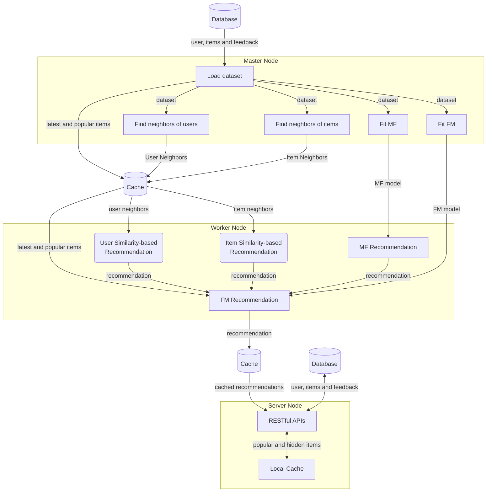

# How It Works




## Architecture

```toml
[master]

# GRPC port of the master node. The default value is 8086.
port = 8086

# gRPC host of the master node. The default values is "0.0.0.0".
host = "0.0.0.0"

# Number of working jobs in the master node. The default value is 1.
n_jobs = 1

# Meta information timeout. The default value is 10s.
meta_timeout = "10s"
```

## Recommendation Flow
