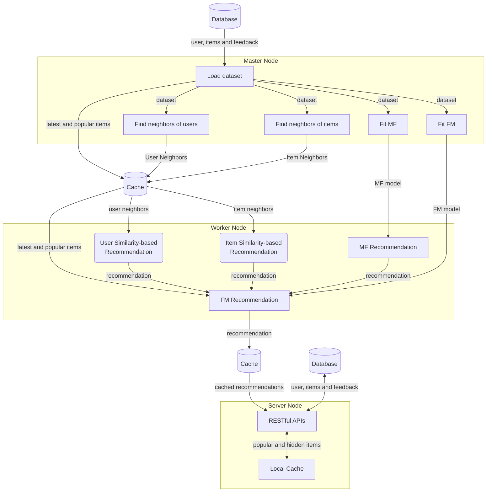

# How It Works

The workflow of Gorse is depicted in the following flowchart:



<FontIcon icon="rectangle"/> represents components in each node.

## Architecture

The master node loads data from the database. In the process of loading data, popular items and the latest items are written to the cache. Then, the master node searches for neighbors and training recommendation models. In the background, the random search is used to find the optimal recommendation model for current data. The worker nodes pull recommendation models from the master node and generate recommendations for each user. The server nodes provide RESTful APIs. Workers and servers connect to the master node via GRPC, which is configured in the configuration file.

```toml
[master]

# GRPC port of the master node. The default value is 8086.
port = 8086

# gRPC host of the master node. The default values is "0.0.0.0".
host = "0.0.0.0"

# Number of working jobs in the master node. The default value is 1.
n_jobs = 1

# Meta information timeout. The default value is 10s.
meta_timeout = "10s"
```

The number of working jobs for the master node is set by `master.n_jobs`. For workers, the number of working jobs is set by the command line flag.

## Recommendation Flow

Gorse works like a waterfall. Users, items and feedbacks are the sources of water. Intermediate results will be cached in cache storage (eg. Redis) such as water falling from the first waterfall will be cached in the intermediate pool. After several stages, selected items are recommended to users.

::: center

[](https://www.google.com.hk/maps/place/9494%2B2XX+Sanzhe+Pujingqu,+Xueshi+Rd,+Yueqing,+Wenzhou,+Zhejiang,+China,+325613/@28.367624,121.1074902,17z/data=!4m14!1m7!3m6!1s0x344fb1c336f6089f:0x289b31d5bd3c5903!2zQ2hpbmEsIFpoZWppYW5nLCBXZW56aG91LCBZdWVxaW5nLCDpm4HojaHplYfkuInmipjngJE!8m2!3d28.372423!4d121.091304!16s%2Fg%2F1tlqmqj3!3m5!1s0x344fb1be99ca855b:0x1d80848a11ae084d!8m2!3d28.367624!4d121.1074902!16s%2Fg%2F1tm8bqtb)

:::

The intermediate cache is configurable. Increasing cache size might improve recommendations since the recommender system has more information on data but also consumes more cache storage. The expiration time of cache should be traded off between freshness and CPU costs.

```toml
[recommend]

# The cache size for recommended/popular/latest items. The default value is 10.
cache_size = 100

# Recommended cache expire time. The default value is 72h.
cache_expire = "72h"
```

The recommendation flow will be introduced in top-down method.
