# Pipeline


## Default Pipeline


The workflow of Gorse is depicted in the following flowchart:


<FontIcon icon="rectangle"/> represents components in each node.

## Architecture

The master node loads data from the database. In the process of loading data, popular items and the latest items are written to the cache. Then, the master node searches for neighbors and training recommendation models. In the background, the random search is used to find the optimal recommendation model for current data. The worker nodes pull recommendation models from the master node and generate recommendations for each user. The server nodes provide RESTful APIs. Workers and servers connect to the master node via GRPC, which is configured in the configuration file.

```toml
[master]

# GRPC port of the master node. The default value is 8086.
port = 8086

# gRPC host of the master node. The default values is "0.0.0.0".
host = "0.0.0.0"

# Number of working jobs in the master node. The default value is 1.
n_jobs = 1

# Meta information timeout. The default value is 10s.
meta_timeout = "10s"
```

The number of working jobs for the master node is set by `master.n_jobs`. For workers, the number of working jobs is set by the command line flag.

## Recommendation Flow

Gorse works like a waterfall. Users, items and feedbacks are the sources of water. Intermediate results will be cached in cache storage (eg. Redis) such as water falling from the first waterfall will be cached in the intermediate pool. After several stages, selected items are recommended to users.

::: center

[](https://www.google.com.hk/maps/place/9494%2B2XX+Sanzhe+Pujingqu,+Xueshi+Rd,+Yueqing,+Wenzhou,+Zhejiang,+China,+325613/@28.367624,121.1074902,17z/data=!4m14!1m7!3m6!1s0x344fb1c336f6089f:0x289b31d5bd3c5903!2zQ2hpbmEsIFpoZWppYW5nLCBXZW56aG91LCBZdWVxaW5nLCDpm4HojaHplYfkuInmipjngJE!8m2!3d28.372423!4d121.091304!16s%2Fg%2F1tlqmqj3!3m5!1s0x344fb1be99ca855b:0x1d80848a11ae084d!8m2!3d28.367624!4d121.1074902!16s%2Fg%2F1tm8bqtb)

:::

The intermediate cache is configurable. Increasing cache size might improve recommendations since the recommender system has more information on data but also consumes more cache storage. The expiration time of the cache should be traded off between freshness and CPU costs.

```toml
[recommend]

# The cache size for recommended/popular/latest items. The default value is 10.
cache_size = 100

# Recommended cache expire time. The default value is 72h.
cache_expire = "72h"
```

The recommendation flow will be introduced in the top-down method.

### Master: Neighbors and Models

The master node is driven by data loading. Data loading happens in every `model_fit_period`. The latest items and popular items can be collected during loading data. Once data is loaded, the following tasks start.

- **Find Neighbors:** User neighbors and item neighbors are found and cached.
- **Fit MF and FM** The matrix factorization model and factorization machine model are trained and delivered to workers.
- **Optimize MF and FM:** In every `model_search_period`, random search is used to optimize MF and FM. The model searcher will generate `model_search_trials` combinations of hyper-parameters and the model with the best score during `model_search_epoch` epoch is used in the next model training period. In most cases, there is no need to change these two options. By default, the model size is fixed, set `enable_model_size_search` to search larger models, which consumes more memory.

```toml
[recommend.collaborative]

# The time period for model fitting. The default value is "60m".
model_fit_period = "60m"

# The time period for model searching. The default value is "360m".
model_search_period = "360m"

# The number of epochs for model searching. The default value is 100.
model_search_epoch = 100

# The number of trials for model searching. The default value is 10.
model_search_trials = 10

# Enable searching models of different sizes, which consume more memory. The default value is false.
enable_model_size_search = false
```

Once data is loaded, neighbor searching and model training starts in parallel. After neighbor searching and model training is finished, model optimization starts if the last optimize time is `model_search_period` ago.


### Worker: Offline Recommendation

Workers nodes generate and write offline recommendations to the cache database. The worker node checks each user in every `check_recommend_period`. If a user's active time is greater than his or her latest offline recommendation cache or the cache is generated before `refresh_recommend_period`, the worker starts to refresh offline recommendations for this user.


First, the worker collects candidates from the latest items, popular items, user similarity-based recommendations, item similarity-based recommendations and matrix factorization recommendations. Sources of candidates can be enabled or disabled in the configuration. Then, candidates are ranked by the factorization machine and read items are removed. If `enable_click_through_prediction` is `false`, candidates are ranked randomly. Finally, popular items and the latest items will be injected into recommendations with probabilities defined in `explore_recommend`. Offline recommendation results will be written to the cache.

```toml
[recommend.offline]

# The time period to check recommendation for users. The default values is 1m.
check_recommend_period = "1m"

# The time period to refresh recommendation for inactive users. The default values is 120h.
refresh_recommend_period = "24h"

# Enable latest recommendation during offline recommendation. The default value is false.
enable_latest_recommend = true

# Enable popular recommendation during offline recommendation. The default value is false.
enable_popular_recommend = false

# Enable user-based similarity recommendation during offline recommendation. The default value is false.
enable_user_based_recommend = true

# Enable item-based similarity recommendation during offline recommendation. The default value is false.
enable_item_based_recommend = false

# Enable collaborative filtering recommendation during offline recommendation. The default value is true.
enable_collaborative_recommend = true

# Enable click-though rate prediction during offline recommendation. Otherwise, results from multi-way recommendation
# would be merged randomly. The default value is false.
enable_click_through_prediction = true

# The explore recommendation method is used to inject popular items or latest items into recommended result:
#   popular: Recommend popular items to cold-start users.
#   latest: Recommend latest items to cold-start users.
# The default values is { popular = 0.0, latest = 0.0 }.
explore_recommend = { popular = 0.1, latest = 0.2 }
```

### Server: Online Recommendation

The server node exposes RESTful APIs for data and recommendations.

#### Data APIs

Data APIs provide CRUD for users, items and feedback. When inserting feedback, the user and the item must exist. There are options in the configuration to insert users or items automatically or ignore feedback with non-existed users or items.

```toml
[server]

# Insert new users while inserting feedback. The default value is true.
auto_insert_user = true

# Insert new items while inserting feedback. The default value is true.
auto_insert_item = true
```

#### Recommendation APIs

Recommendation APIs return recommendation results. For non-personalized recommendations (latest items, popular items or neighbors), the server node fetches cached recommendations from the cache database and sends responses. But the server node needs to do more work for personalized recommendations.

- **Recommendation:** Offline recommendations by workers are written to responses and read items will be removed. But if the offline recommendation cache is consumed, fallback recommenders will be used. Recommenders in `fallback_recommend` will be tried in order.

```mermaid
flowchart LR
    start((Start))-->offline[Load Offline\nRecommendation]
    offline-->remove1[Remove\nRead Items]
    remove1-->cond1{#recommend\n>= N}
    cond1--yes-->e((End))
    cond1--no-->fallback[#1 Fallback\nRecommendation]
    fallback-->remove2[Remove\nRead Items]
    remove2-->cond2{#recommend\n>= N}
    cond2--yes-->e
    cond2--no-->more["…"]
```



- **Session recommendation:** Session recommender generates recommendations for unregistered users based on user session-wise feedbacks. Session recommendations are generated by an item similarity-based algorithm based on the latest $n$ feedback and read items from feedback will be removed from recommendations. The number of user feedback is set by `num_feedback_fallback_item_based`.


```toml
[recommend.online]

# The fallback recommendation method is used when cached recommendation drained out:
#   item_based: Recommend similar items.
#   popular: Recommend popular items.
#   latest: Recommend latest items.
# Recommenders are used in order. The default values is ["latest"].
fallback_recommend = ["item_based", "latest"]

# The number of feedback used in fallback item-based similar recommendation. The default values is 10.
num_feedback_fallback_item_based = 10
```

Besides recommendations, there are two important configurations for servers.

- **Clock Error:** Gorse supports feedback with future timestamps, thus Gorse relies on a correct clock. However, clocks in different hosts might be different, `clock_error` should be the maximal difference between clocks.
- **Cache Expiration:** Servers cache hidden items and popular items in the local cache to avoid accessing the external database too frequently. The local cache is refreshed every `cache_expire`.

```toml
[server]

# Clock error in the cluster. The default value is 5s.
clock_error = "5s"

# Server-side cache expire time. The default value is 10s.
cache_expire = "10s"
```
