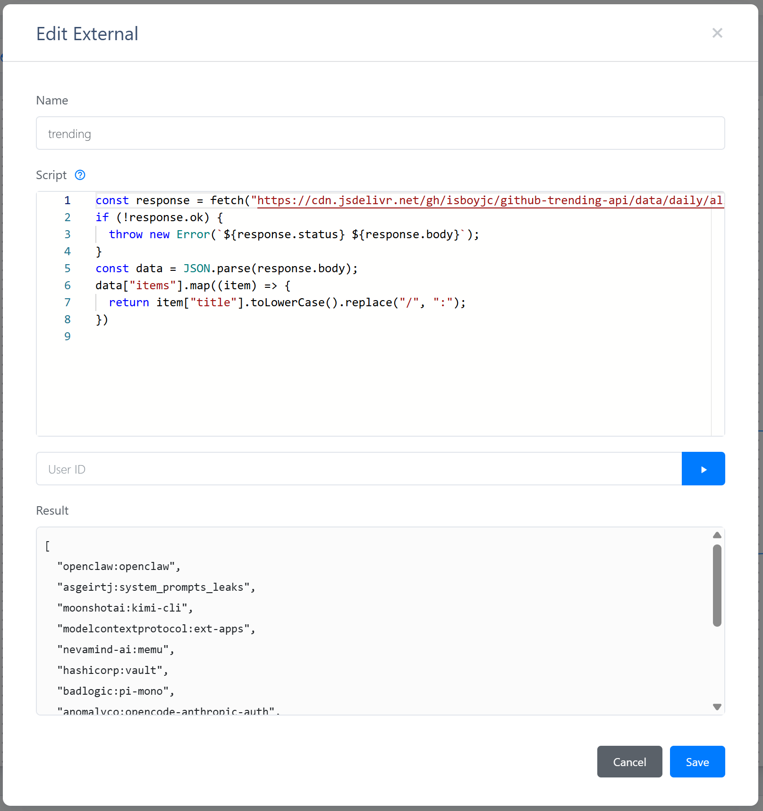

# RecFlow

The Gorse dashboard provides an GUI for visually editing recommendation settings called "RecFlow". The recommendation settings in the configuration file will be visually displayed. After editing and saving, Gorse will prioritize loading the recommendation settings defined by RecFlow.

## Nodes and Connections

- **Data Source** is the starting node of RecFlow. It cannot be deleted or added. It can be connected to multiple recommender nodes. Double-click the node to edit the `[recommend.data_source]` configuration.
- **Recommender** accepts connections from the data source and can be connected to the ranker node, fallback node, and recommend node. There are six types of recommender nodes:
  - **Latest** items, cannot be deleted or edited;
  - **Non-personalized**, multiple allowed, corresponding to `[[recommend.non-personalized]]` in the configuration file.
  - **External API**, multiple allowed, corresponding to `[[recommend.external]]` in the configuration file.
  - **Item-to-Item**, multiple allowed, corresponding to `[[recommend.item-to-item]]` in the configuration file.
  - **Collaborative Filtering**, at most one allowed, corresponding to `[recommend.collaborative]` in the configuration file.
  - **User-to-User**, multiple allowed, corresponding to `[[recommend.user-to-user]]` in the configuration file.
- **Ranker** node, at most one allowed, corresponding to `[recommend.ranker]` in the configuration file.
- **Fallback** node, at most one allowed, corresponding to `[recommend.fallback]` in the configuration file.
- **Recommend** is the end node of RecFlow. It cannot be deleted or added. Double-click the node to edit the `[recommend]` configuration. It only accepts three types of connections:
  - Ranker: In most cases, items recommended to users come from the ranker node.
  - Recommender: When not using a ranker, recommendation results can be obtained directly from recommender nodes, but only one recommender node can be connected to the recommend node.
  - Fallback: When the ranker node or recommender node has no recommendation results, the recommendation results from the fallback node are used.

## Preview

In addition to editing nodes and connections, the editor also provides previews for some types of nodes.

### External API Preview

Double-click the External API node to see the preview UI for external API recommendations.

After entering a User ID and clicking the run button, the preview UI will call the external API to retrieve and display recommendation results.

### LLM Ranker Preview

Double-click the Ranker node and select the type as LLM to see the preview UI for Large Language Model ranking.

After entering a User ID and clicking the run button, the preview UI will read the user's recent feedback and the latest items, and use the prompt template to render the prompt. The rendered prompt is sent to the Large Language Model, which ranks the latest items based on recent feedback and displays the ranking results.

::: tip
The LLM ranker preview is mainly used to check if the format of the LLM output meets expectations. If the returned format is incorrect or a lot of ranking content is missing, the ranking effect cannot be discussed.
:::

## Save and Clear

After editing the RecFlow, click the "Save" button in the upper right corner to save the current RecFlow. Click the "Clear" button to restore the recommendation settings from the configuration file. If there is no need to edit the recommendation settings subsequently, it is recommended to define the recommendation settings in the [configuration file](../config.md#recommend).
