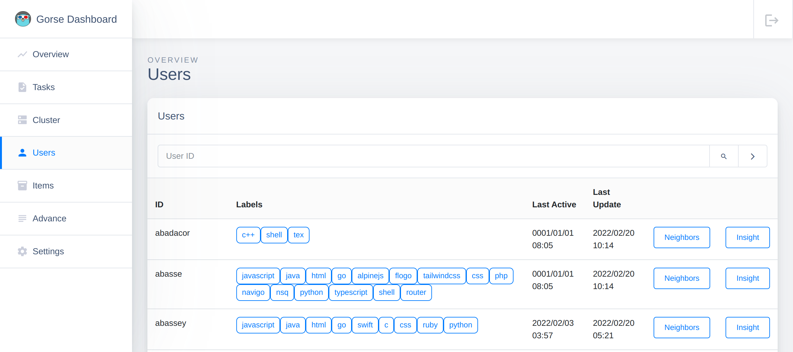

# Gorse Dashboard

The master node provides the Gorse dashboard, which can be accessed through HTTP port (the default values is `8088`) of the master node. The HTTP port is specified in configuration file.

## Login

The default configuration allows access to the console without logging in. In the configuration file, the username and password to log in to the dashboard can be set.

```toml
[master]

# Username for the master node dashboard.
dashboard_user_name = ""

# Password for the master node dashboard.
dashboard_password = ""
```

After setting a username and password, you will be redirected to the login page the first time you access the dashboard.

::: center

:::

## Overview

The top part of the overview page shows the number of users, items, feedback, valid positive feedback and valid negative feedback in Gorse. The middle part of the overview page shows the proportion of each positive feedback given by users over time, and the curve of the corresponding feedback can be hidden by clicking on the feedback type label. The bottom part of the overview page shows the popular items and the latest items in the system, as well as other status in the system.


## Tasks

The task page displays the tasks in Gorse, including the task name, task status, task start time, task end time, and task progress.


## Cluster

The cluster page lists nodes in the cluster, displaying information such as node type, node name, node IP and address for APIs and metrics. If a container orchestration tool is used, the node IP may not be accessible externally.


## Users

The user page lists all users currently present in Gorse and can be searched by user ID. The information displayed includes the user ID, user labels, last active time and last update time of recommendation.



Click on "Neighbors" to see similar users of this user.


Click on "Insight" to see the user's history and the recommendations Gorse has generated for this user.


## Items

The item page lists all items currently in Gorse and can be searched by item ID. The information displayed includes the item ID, item categories, whether it is hidden or not, timestamp, item labels and item description.


Click on "Neighbors" to see the similar items for each item.


## Data Export and Import

The advance page allows importing and exporting data.
- The "Export Users" button exports users to a CSV file with the format of user ID, user labels.
- The "Export Items" button exports items to a CSV file with the format of item ID, hidden or not, item categories, timestamp, item labels and item description.
- The "Export Feedback" button exports feedbacks to a CSV file in the format of feedback type, user ID, item ID and timestamp.


- The "Import Users" button allows you to enter the "Import Users" page and preview the imported data after selecting the file. You can set the field separator, label separator, the mapping of each field and the existence of header row. Once the settings are correct, you can click "Confirm Import" to complete the data import.


- The "Import Items" button allows you to enter the "Import Items" page, which operates with the same logic as the "Import Users" page.


- The "Import Feedback" button allows you to enter the "Import Feedback" page, with the same logic as for importing users.


## Configurations

The settings page shows the configurations currently used by Gorse. The configurations used by the system are determined by a combination of the configuration file, command line options, and environment variables, so there may be differences between the configurations seen on the settings page and the configuration file used.


