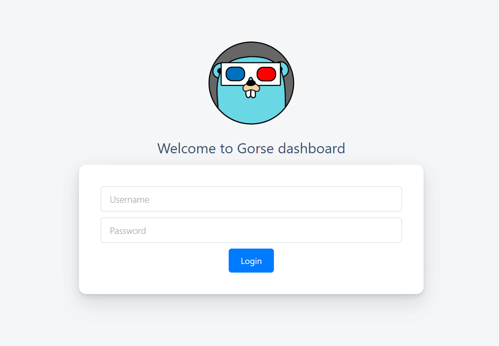

# Gorse Dashboard

The master node provides the Gorse dashboard, which can be accessed through the HTTP port (the default value is `8088`) of the master node. The HTTP host and the HTTP port are specified in the [`[master]`](./config#master) section of configuration file.

## Authorization

The default configuration allows access to the console without authorization.

- Username and password: The username and password for the dashboard can be set In the [`[master]`](./config#master) section of configuration file. A login page will appear when accessing the dashboard if the username and password are set.
::: center

:::
- OpenID Connect: Enable and config the [`[oidc]`](./config#oidc) section of configuration file. You will be redirected to the identity provider for authentication when accessing the dashboard if OpenID Connect is enabled.
