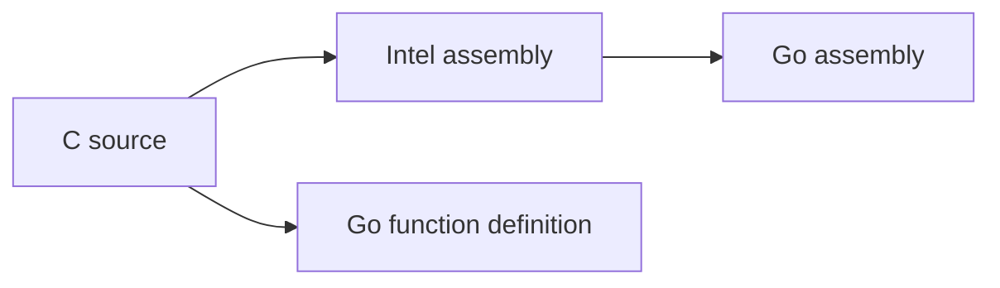

# How to Use AVX512 in Golang

AVX512 is the latest generation of SIMD instructions released by Intel, which can process 512 bits of data in one instruction cycle, equivalent to 16 single-precision floating point numbers or 8 double-precision floating point numbers. The training and inference process of recommendation models in [Gorse](https://gorse.io/) requires a lot of vector computation, and AVX512 can theoretically bring some acceleration effect. Unfortunately, the Go compiler does not automatically generate SIMD instructions.

[MinIO](https://github.com/minio) had open-sourced a tool to convert Intel assembly to Go assembly [c2goasm](https://github.com/minio/c2goasm). First, the vectorized functions are implemented in C, and the assembly containing the SIMD instructions is compiled by Clang. Then, since [Go assembly](https://go.dev/doc/asm) [supports AVX512](https://github.com/golang/go/wiki/AVX512), the functions implemented by SIMD can be called through Go assembly. The c2goasm solution is very effective, however, the project has not been updated for almost 4 years, and after testing it cannot handle AVX512 instructions.

To use AVX512 in Go, we have developed a toolkit for compiling C into Go assembly functions [goat](https://github.com/gorse-io/gorse/tree/master/cmd/goat) and implemented a library of vectorized functions with the help of goat [github.com/gorse-io/gorse/base/floats](https://github.com/gorse-io/gorse/tree/master/base/floats). Inheriting the idea of c2goasm, `goat` implements further enhancements.

1. Starting directly from the C source code to get Go assembly functions, the user does not have to compile the C source code itself.
2. It will also generate Go function definitions based on C function definitions, so users do not need to write Go function definitions by hand.

The post will detail the technical implementation of goat ideas, welcome to read the code [github.com/gorse-io/gorse/cmd/goat](https://github.com/gorse-io/gorse/tree/master/cmd/goat).



## Compile Assembly from C

The C implementation of the function `_mm512_mul_to` multiplies two floating point arrays and then saves the result in a third array. In general, the compiler automatically generates assembly that uses SIMD. Here, intrinsic is used to ensure that SIMD instructions are generated.

```c
#include <immintrin.h>

void _mm512_mul_to(float *a, float *b, float *c, int64_t n)
{
    int epoch = n / 16;
    int remain = n % 16;
    for (int i = 0; i < epoch; i++)
    {
        __m512 v1 = _mm512_loadu_ps(a);
        __m512 v2 = _mm512_loadu_ps(b);
        __m512 v = _mm512_mul_ps(v1, v2);
        _mm512_storeu_ps(c, v);
        a += 16;
        b += 16;
        c += 16;
    }
    if (remain >= 8)
    {
        __m256 v1 = _mm256_loadu_ps(a);
        __m256 v2 = _mm256_loadu_ps(b);
        __m256 v = _mm256_mul_ps(v1, v2);
        _mm256_storeu_ps(c, v);
        a += 8;
        b += 8;
        c += 8;
        remain -= 8;
    }
    for (int i = 0; i < remain; i++)
    {
        c[i] = a[i] * b[i];
    }
}
```

Save the code to `mm512_mul_to.c` and use the following command to compile the C code to assembly as well as binary.

```bash
# Generate assembly
clang -S -c mm512_mul_to.c -o mm512_mul_to.s \
  -O3 -mavx -mfma -mavx512f -mavx512dq \
  -mno-red-zone -mstackrealign -mllvm -inline-threshold=1000 \
  -fno-asynchronous-unwind-tables -fno-exceptions -fno-rtti

# Generate binary
clang -c mm512_mul_to.c -o mm512_mul_to.o \
  -O3 -mavx -mfma -mavx512f -mavx512dq \
  -mno-red-zone -mstackrealign -mllvm -inline-threshold=1000 \
  -fno-asynchronous-unwind-tables -fno-exceptions -fno-rtti
```

::: details mm512_mul_to.s

```asm
 .globl _mm512_mul_to                   # -- Begin function _mm512_mul_to
 .p2align 4, 0x90
 .type _mm512_mul_to,@function
_mm512_mul_to:                          # @_mm512_mul_to
# %bb.0:
 pushq %rbp
 movq %rsp, %rbp
 andq $-8, %rsp
 leaq 15(%rcx), %r9
 testq %rcx, %rcx
 cmovnsq %rcx, %r9
 shrq $4, %r9
 movl %r9d, %eax
 shll $4, %eax
 subl %eax, %ecx
 testl %r9d, %r9d
 jle .LBB3_6
# %bb.1:
 leal -1(%r9), %eax
 movl %r9d, %r8d
 andl $3, %r8d
 cmpl $3, %eax
 jb .LBB3_4
# %bb.2:
 andl $-4, %r9d
 negl %r9d
 .p2align 4, 0x90
.LBB3_3:                                # =>This Inner Loop Header: Depth=1
 vmovups (%rdi), %zmm0
 vmulps (%rsi), %zmm0, %zmm0
 vmovups %zmm0, (%rdx)
 vmovups 64(%rdi), %zmm0
 vmulps 64(%rsi), %zmm0, %zmm0
 vmovups %zmm0, 64(%rdx)
 vmovups 128(%rdi), %zmm0
 vmulps 128(%rsi), %zmm0, %zmm0
 vmovups %zmm0, 128(%rdx)
 vmovups 192(%rdi), %zmm0
 vmulps 192(%rsi), %zmm0, %zmm0
 vmovups %zmm0, 192(%rdx)
 addq $256, %rdi                      # imm = 0x100
 addq $256, %rsi                      # imm = 0x100
 addq $256, %rdx                      # imm = 0x100
 addl $4, %r9d
 jne .LBB3_3
.LBB3_4:
 testl %r8d, %r8d
 je .LBB3_6
 .p2align 4, 0x90
.LBB3_5:                                # =>This Inner Loop Header: Depth=1
 vmovups (%rdi), %zmm0
 vmulps (%rsi), %zmm0, %zmm0
 vmovups %zmm0, (%rdx)
 addq $64, %rdi
 addq $64, %rsi
 addq $64, %rdx
 addl $-1, %r8d
 jne .LBB3_5
.LBB3_6:
 cmpl $7, %ecx
 jle .LBB3_8
# %bb.7:
 vmovups (%rdi), %ymm0
 vmulps (%rsi), %ymm0, %ymm0
 vmovups %ymm0, (%rdx)
 addq $32, %rdi
 addq $32, %rsi
 addq $32, %rdx
 addl $-8, %ecx
.LBB3_8:
 testl %ecx, %ecx
 jle .LBB3_14
# %bb.9:
 movl %ecx, %ecx
 leaq -1(%rcx), %rax
 movl %ecx, %r8d
 andl $3, %r8d
 cmpq $3, %rax
 jae .LBB3_15
# %bb.10:
 xorl %eax, %eax
 jmp .LBB3_11
.LBB3_15:
 andl $-4, %ecx
 xorl %eax, %eax
 .p2align 4, 0x90
.LBB3_16:                               # =>This Inner Loop Header: Depth=1
 vmovss (%rdi,%rax,4), %xmm0            # xmm0 = mem[0],zero,zero,zero
 vmulss (%rsi,%rax,4), %xmm0, %xmm0
 vmovss %xmm0, (%rdx,%rax,4)
 vmovss 4(%rdi,%rax,4), %xmm0           # xmm0 = mem[0],zero,zero,zero
 vmulss 4(%rsi,%rax,4), %xmm0, %xmm0
 vmovss %xmm0, 4(%rdx,%rax,4)
 vmovss 8(%rdi,%rax,4), %xmm0           # xmm0 = mem[0],zero,zero,zero
 vmulss 8(%rsi,%rax,4), %xmm0, %xmm0
 vmovss %xmm0, 8(%rdx,%rax,4)
 vmovss 12(%rdi,%rax,4), %xmm0          # xmm0 = mem[0],zero,zero,zero
 vmulss 12(%rsi,%rax,4), %xmm0, %xmm0
 vmovss %xmm0, 12(%rdx,%rax,4)
 addq $4, %rax
 cmpq %rax, %rcx
 jne .LBB3_16
.LBB3_11:
 testq %r8, %r8
 je .LBB3_14
# %bb.12:
 leaq (%rdx,%rax,4), %rcx
 leaq (%rsi,%rax,4), %rdx
 leaq (%rdi,%rax,4), %rax
 xorl %esi, %esi
 .p2align 4, 0x90
.LBB3_13:                               # =>This Inner Loop Header: Depth=1
 vmovss (%rax,%rsi,4), %xmm0            # xmm0 = mem[0],zero,zero,zero
 vmulss (%rdx,%rsi,4), %xmm0, %xmm0
 vmovss %xmm0, (%rcx,%rsi,4)
 addq $1, %rsi
 cmpq %rsi, %r8
 jne .LBB3_13
.LBB3_14:
 movq %rbp, %rsp
 popq %rbp
 vzeroupper
 retq
.Lfunc_end3:
 .size _mm512_mul_to, .Lfunc_end3-_mm512_mul_to
                                        # -- End function
```

:::

In Go, it is easy to execute the compile command with `exec.Command`.

## Construct Go Code from Assembly

### Convert Assembly

`mm512_mul_to.o` is the binary of the function after it has been compiled. By using `objdump` you can see that each assembly has been converted to machine code.

```bash
objdump -d mm512_mul_to.o --insn-width 16
```

::: details objdump output

```
0000000000000460 <_mm512_mul_to>:
 460:   55                              push   %rbp
 461:   48 89 e5                        mov    %rsp,%rbp
 464:   48 83 e4 f8                     and    $0xfffffffffffffff8,%rsp
 468:   4c 8d 49 0f                     lea    0xf(%rcx),%r9
 46c:   48 85 c9                        test   %rcx,%rcx
 46f:   4c 0f 49 c9                     cmovns %rcx,%r9
 473:   49 c1 e9 04                     shr    $0x4,%r9
 477:   44 89 c8                        mov    %r9d,%eax
 47a:   c1 e0 04                        shl    $0x4,%eax
 47d:   29 c1                           sub    %eax,%ecx
 47f:   45 85 c9                        test   %r9d,%r9d
 482:   0f 8e bc 00 00 00               jle    544 <_mm512_mul_to+0xe4>
 488:   41 8d 41 ff                     lea    -0x1(%r9),%eax
 48c:   45 89 c8                        mov    %r9d,%r8d
 48f:   41 83 e0 03                     and    $0x3,%r8d
 493:   83 f8 03                        cmp    $0x3,%eax
 496:   72 74                           jb     50c <_mm512_mul_to+0xac>
 498:   41 83 e1 fc                     and    $0xfffffffc,%r9d
 49c:   41 f7 d9                        neg    %r9d
 49f:   90                              nop
 4a0:   62 f1 7c 48 10 07               vmovups (%rdi),%zmm0
 4a6:   62 f1 7c 48 59 06               vmulps (%rsi),%zmm0,%zmm0
 4ac:   62 f1 7c 48 11 02               vmovups %zmm0,(%rdx)
 4b2:   62 f1 7c 48 10 47 01            vmovups 0x40(%rdi),%zmm0
 4b9:   62 f1 7c 48 59 46 01            vmulps 0x40(%rsi),%zmm0,%zmm0
 4c0:   62 f1 7c 48 11 42 01            vmovups %zmm0,0x40(%rdx)
 4c7:   62 f1 7c 48 10 47 02            vmovups 0x80(%rdi),%zmm0
 4ce:   62 f1 7c 48 59 46 02            vmulps 0x80(%rsi),%zmm0,%zmm0
 4d5:   62 f1 7c 48 11 42 02            vmovups %zmm0,0x80(%rdx)
 4dc:   62 f1 7c 48 10 47 03            vmovups 0xc0(%rdi),%zmm0
 4e3:   62 f1 7c 48 59 46 03            vmulps 0xc0(%rsi),%zmm0,%zmm0
 4ea:   62 f1 7c 48 11 42 03            vmovups %zmm0,0xc0(%rdx)
 4f1:   48 81 c7 00 01 00 00            add    $0x100,%rdi
 4f8:   48 81 c6 00 01 00 00            add    $0x100,%rsi
 4ff:   48 81 c2 00 01 00 00            add    $0x100,%rdx
 506:   41 83 c1 04                     add    $0x4,%r9d
 50a:   75 94                           jne    4a0 <_mm512_mul_to+0x40>
 50c:   45 85 c0                        test   %r8d,%r8d
 50f:   74 33                           je     544 <_mm512_mul_to+0xe4>
 511:   66 2e 0f 1f 84 00 00 00 00 00   nopw   %cs:0x0(%rax,%rax,1)
 51b:   0f 1f 44 00 00                  nopl   0x0(%rax,%rax,1)
 520:   62 f1 7c 48 10 07               vmovups (%rdi),%zmm0
 526:   62 f1 7c 48 59 06               vmulps (%rsi),%zmm0,%zmm0
 52c:   62 f1 7c 48 11 02               vmovups %zmm0,(%rdx)
 532:   48 83 c7 40                     add    $0x40,%rdi
 536:   48 83 c6 40                     add    $0x40,%rsi
 53a:   48 83 c2 40                     add    $0x40,%rdx
 53e:   41 83 c0 ff                     add    $0xffffffff,%r8d
 542:   75 dc                           jne    520 <_mm512_mul_to+0xc0>
 544:   83 f9 07                        cmp    $0x7,%ecx
 547:   7e 1b                           jle    564 <_mm512_mul_to+0x104>
 549:   c5 fc 10 07                     vmovups (%rdi),%ymm0
 54d:   c5 fc 59 06                     vmulps (%rsi),%ymm0,%ymm0
 551:   c5 fc 11 02                     vmovups %ymm0,(%rdx)
 555:   48 83 c7 20                     add    $0x20,%rdi
 559:   48 83 c6 20                     add    $0x20,%rsi
 55d:   48 83 c2 20                     add    $0x20,%rdx
 561:   83 c1 f8                        add    $0xfffffff8,%ecx
 564:   85 c9                           test   %ecx,%ecx
 566:   0f 8e ac 00 00 00               jle    618 <_mm512_mul_to+0x1b8>
 56c:   89 c9                           mov    %ecx,%ecx
 56e:   48 8d 41 ff                     lea    -0x1(%rcx),%rax
 572:   41 89 c8                        mov    %ecx,%r8d
 575:   41 83 e0 03                     and    $0x3,%r8d
 579:   48 83 f8 03                     cmp    $0x3,%rax
 57d:   73 04                           jae    583 <_mm512_mul_to+0x123>
 57f:   31 c0                           xor    %eax,%eax
 581:   eb 5b                           jmp    5de <_mm512_mul_to+0x17e>
 583:   83 e1 fc                        and    $0xfffffffc,%ecx
 586:   31 c0                           xor    %eax,%eax
 588:   0f 1f 84 00 00 00 00 00         nopl   0x0(%rax,%rax,1)
 590:   c5 fa 10 04 87                  vmovss (%rdi,%rax,4),%xmm0
 595:   c5 fa 59 04 86                  vmulss (%rsi,%rax,4),%xmm0,%xmm0
 59a:   c5 fa 11 04 82                  vmovss %xmm0,(%rdx,%rax,4)
 59f:   c5 fa 10 44 87 04               vmovss 0x4(%rdi,%rax,4),%xmm0
 5a5:   c5 fa 59 44 86 04               vmulss 0x4(%rsi,%rax,4),%xmm0,%xmm0
 5ab:   c5 fa 11 44 82 04               vmovss %xmm0,0x4(%rdx,%rax,4)
 5b1:   c5 fa 10 44 87 08               vmovss 0x8(%rdi,%rax,4),%xmm0
 5b7:   c5 fa 59 44 86 08               vmulss 0x8(%rsi,%rax,4),%xmm0,%xmm0
 5bd:   c5 fa 11 44 82 08               vmovss %xmm0,0x8(%rdx,%rax,4)
 5c3:   c5 fa 10 44 87 0c               vmovss 0xc(%rdi,%rax,4),%xmm0
 5c9:   c5 fa 59 44 86 0c               vmulss 0xc(%rsi,%rax,4),%xmm0,%xmm0
 5cf:   c5 fa 11 44 82 0c               vmovss %xmm0,0xc(%rdx,%rax,4)
 5d5:   48 83 c0 04                     add    $0x4,%rax
 5d9:   48 39 c1                        cmp    %rax,%rcx
 5dc:   75 b2                           jne    590 <_mm512_mul_to+0x130>
 5de:   4d 85 c0                        test   %r8,%r8
 5e1:   74 35                           je     618 <_mm512_mul_to+0x1b8>
 5e3:   48 8d 0c 82                     lea    (%rdx,%rax,4),%rcx
 5e7:   48 8d 14 86                     lea    (%rsi,%rax,4),%rdx
 5eb:   48 8d 04 87                     lea    (%rdi,%rax,4),%rax
 5ef:   31 f6                           xor    %esi,%esi
 5f1:   66 2e 0f 1f 84 00 00 00 00 00   nopw   %cs:0x0(%rax,%rax,1)
 5fb:   0f 1f 44 00 00                  nopl   0x0(%rax,%rax,1)
 600:   c5 fa 10 04 b0                  vmovss (%rax,%rsi,4),%xmm0
 605:   c5 fa 59 04 b2                  vmulss (%rdx,%rsi,4),%xmm0,%xmm0
 60a:   c5 fa 11 04 b1                  vmovss %xmm0,(%rcx,%rsi,4)
 60f:   48 83 c6 01                     add    $0x1,%rsi
 613:   49 39 f0                        cmp    %rsi,%r8
 616:   75 e8                           jne    600 <_mm512_mul_to+0x1a0>
 618:   48 89 ec                        mov    %rbp,%rsp
 61b:   5d                              pop    %rbp
 61c:   c5 f8 77                        vzeroupper 
 61f:   c3                              retq   
```

:::

#### Encoding Machine Code

Go assembly provides three instructions for representing binary machine code.

- `BYTE` encodes one byte of binary data
- `WORD` encodes two bytes of binary data
- `LONG` encodes four bytes of binary data

If the instruction machine code length is exactly a multiple of two, for example

```asm
 498: 41 83 e1 fc and $0xfffffffc,%r9d
```

can be converted to

```asm
 LONG $0xfce18341
```

But if the length is not a multiple of two, for example

```asm
 4b2: 62 f1 7c 48 10 47 01 vmovups 0x40(%rdi),%zmm0
```

It requires a combination of three instructions to represent

```asm
 LONG $0x487cf162; WORD $0x4710; BYTE $0x01 // vmovups  64(%rdi), %zmm0
```

Note that the byte order of the instruction encoding and the byte order of the `objdump` output are reversed.

#### Function Definition and Parameters

In C assembly, if the function has no more than 6 arguments, the arguments are stored in registers and passed to the function in the following order of placement: `%rdi`, `%rsi`, `%rdx`, `%rcx`, `%r8` and `%r9`. However, in Go assembly, function arguments are placed in memory starting from the address held in the `FP` register, which requires us to move the arguments in memory to the register.

The `_mm512_mul_to` function has four arguments, so it is necessary to move the four arguments before the function starts.

```asm
TEXT -_mm512_mul_to(SB), $0-32
  MOVQ a+0(FP), DI
  MOVQ b+8(FP), SI
  MOVQ c+16(FP), DX
  MOVQ n+24(FP), CX
```

The function definition consists of three parts: the `TEXT` keyword, the name starting with `-` and ending with `(SB)`, and finally the parameter memory size of 32 bytes. The information about the number of arguments is not available in assembly and needs to be obtained from the C function definition (refer to [Generating go function definitions](#generate-go-function-definitions)).

#### Redirect Jump Instruction

x86 jump instructions jump to absolute addresses and direct encoding of jump instructions does not work. Therefore, jump instructions need to be converted to jump instructions in Go assembly.

- **Converting tags:** Go assembly tags cannot start with `.`, so you need to remove the `.`.
- **Conversion commands:** Go assembly jump commands are in uppercase.

After the above three steps, the final Go assembly code is obtained

::: details Go assembly

```asm
TEXT -_mm512_mul_to(SB), $0-32
 MOVQ a+0(FP), DI
 MOVQ b+8(FP), SI
 MOVQ c+16(FP), DX
 MOVQ n+24(FP), CX
 BYTE $0x55 // pushq %rbp
 WORD $0x8948; BYTE $0xe5 // movq %rsp, %rbp
 LONG $0xf8e48348 // andq $-8, %rsp
 LONG $0x0f498d4c // leaq 15(%rcx), %r9
 WORD $0x8548; BYTE $0xc9 // testq %rcx, %rcx
 LONG $0xc9490f4c // cmovnsq %rcx, %r9
 LONG $0x04e9c149 // shrq $4, %r9
 WORD $0x8944; BYTE $0xc8 // movl %r9d, %eax
 WORD $0xe0c1; BYTE $0x04 // shll $4, %eax
 WORD $0xc129 // subl %eax, %ecx
 WORD $0x8545; BYTE $0xc9 // testl %r9d, %r9d
 JLE LBB3_6
 LONG $0xff418d41 // leal -1(%r9), %eax
 WORD $0x8945; BYTE $0xc8 // movl %r9d, %r8d
 LONG $0x03e08341 // andl $3, %r8d
 WORD $0xf883; BYTE $0x03 // cmpl $3, %eax
 JB LBB3_4
 LONG $0xfce18341 // andl $-4, %r9d
 WORD $0xf741; BYTE $0xd9 // negl %r9d

LBB3_3:
 LONG $0x487cf162; WORD $0x0710 // vmovups (%rdi), %zmm0
 LONG $0x487cf162; WORD $0x0659 // vmulps (%rsi), %zmm0, %zmm0
 LONG $0x487cf162; WORD $0x0211 // vmovups %zmm0, (%rdx)
 LONG $0x487cf162; WORD $0x4710; BYTE $0x01 // vmovups 64(%rdi), %zmm0
 LONG $0x487cf162; WORD $0x4659; BYTE $0x01 // vmulps 64(%rsi), %zmm0, %zmm0
 LONG $0x487cf162; WORD $0x4211; BYTE $0x01 // vmovups %zmm0, 64(%rdx)
 LONG $0x487cf162; WORD $0x4710; BYTE $0x02 // vmovups 128(%rdi), %zmm0
 LONG $0x487cf162; WORD $0x4659; BYTE $0x02 // vmulps 128(%rsi), %zmm0, %zmm0
 LONG $0x487cf162; WORD $0x4211; BYTE $0x02 // vmovups %zmm0, 128(%rdx)
 LONG $0x487cf162; WORD $0x4710; BYTE $0x03 // vmovups 192(%rdi), %zmm0
 LONG $0x487cf162; WORD $0x4659; BYTE $0x03 // vmulps 192(%rsi), %zmm0, %zmm0
 LONG $0x487cf162; WORD $0x4211; BYTE $0x03 // vmovups %zmm0, 192(%rdx)
 LONG $0x00c78148; WORD $0x0001; BYTE $0x00 // addq $256, %rdi
 LONG $0x00c68148; WORD $0x0001; BYTE $0x00 // addq $256, %rsi
 LONG $0x00c28148; WORD $0x0001; BYTE $0x00 // addq $256, %rdx
 LONG $0x04c18341 // addl $4, %r9d
 JNE LBB3_3

LBB3_4:
 WORD $0x8545; BYTE $0xc0 // testl %r8d, %r8d
 JE LBB3_6

LBB3_5:
 LONG $0x487cf162; WORD $0x0710 // vmovups (%rdi), %zmm0
 LONG $0x487cf162; WORD $0x0659 // vmulps (%rsi), %zmm0, %zmm0
 LONG $0x487cf162; WORD $0x0211 // vmovups %zmm0, (%rdx)
 LONG $0x40c78348 // addq $64, %rdi
 LONG $0x40c68348 // addq $64, %rsi
 LONG $0x40c28348 // addq $64, %rdx
 LONG $0xffc08341 // addl $-1, %r8d
 JNE LBB3_5

LBB3_6:
 WORD $0xf983; BYTE $0x07 // cmpl $7, %ecx
 JLE LBB3_8
 LONG $0x0710fcc5 // vmovups (%rdi), %ymm0
 LONG $0x0659fcc5 // vmulps (%rsi), %ymm0, %ymm0
 LONG $0x0211fcc5 // vmovups %ymm0, (%rdx)
 LONG $0x20c78348 // addq $32, %rdi
 LONG $0x20c68348 // addq $32, %rsi
 LONG $0x20c28348 // addq $32, %rdx
 WORD $0xc183; BYTE $0xf8 // addl $-8, %ecx

LBB3_8:
 WORD $0xc985 // testl %ecx, %ecx
 JLE LBB3_14
 WORD $0xc989 // movl %ecx, %ecx
 LONG $0xff418d48 // leaq -1(%rcx), %rax
 WORD $0x8941; BYTE $0xc8 // movl %ecx, %r8d
 LONG $0x03e08341 // andl $3, %r8d
 LONG $0x03f88348 // cmpq $3, %rax
 JAE LBB3_15
 WORD $0xc031 // xorl %eax, %eax
 JMP LBB3_11

LBB3_15:
 WORD $0xe183; BYTE $0xfc // andl $-4, %ecx
 WORD $0xc031 // xorl %eax, %eax

LBB3_16:
 LONG $0x0410fac5; BYTE $0x87 // vmovss (%rdi,%rax,4), %xmm0
 LONG $0x0459fac5; BYTE $0x86 // vmulss (%rsi,%rax,4), %xmm0, %xmm0
 LONG $0x0411fac5; BYTE $0x82 // vmovss %xmm0, (%rdx,%rax,4)
 LONG $0x4410fac5; WORD $0x0487 // vmovss 4(%rdi,%rax,4), %xmm0
 LONG $0x4459fac5; WORD $0x0486 // vmulss 4(%rsi,%rax,4), %xmm0, %xmm0
 LONG $0x4411fac5; WORD $0x0482 // vmovss %xmm0, 4(%rdx,%rax,4)
 LONG $0x4410fac5; WORD $0x0887 // vmovss 8(%rdi,%rax,4), %xmm0
 LONG $0x4459fac5; WORD $0x0886 // vmulss 8(%rsi,%rax,4), %xmm0, %xmm0
 LONG $0x4411fac5; WORD $0x0882 // vmovss %xmm0, 8(%rdx,%rax,4)
 LONG $0x4410fac5; WORD $0x0c87 // vmovss 12(%rdi,%rax,4), %xmm0
 LONG $0x4459fac5; WORD $0x0c86 // vmulss 12(%rsi,%rax,4), %xmm0, %xmm0
 LONG $0x4411fac5; WORD $0x0c82 // vmovss %xmm0, 12(%rdx,%rax,4)
 LONG $0x04c08348 // addq $4, %rax
 WORD $0x3948; BYTE $0xc1 // cmpq %rax, %rcx
 JNE LBB3_16

LBB3_11:
 WORD $0x854d; BYTE $0xc0 // testq %r8, %r8
 JE LBB3_14
 LONG $0x820c8d48 // leaq (%rdx,%rax,4), %rcx
 LONG $0x86148d48 // leaq (%rsi,%rax,4), %rdx
 LONG $0x87048d48 // leaq (%rdi,%rax,4), %rax
 WORD $0xf631 // xorl %esi, %esi

LBB3_13:
 LONG $0x0410fac5; BYTE $0xb0 // vmovss (%rax,%rsi,4), %xmm0
 LONG $0x0459fac5; BYTE $0xb2 // vmulss (%rdx,%rsi,4), %xmm0, %xmm0
 LONG $0x0411fac5; BYTE $0xb1 // vmovss %xmm0, (%rcx,%rsi,4)
 LONG $0x01c68348 // addq $1, %rsi
 WORD $0x3949; BYTE $0xf0 // cmpq %rsi, %r8
 JNE LBB3_13

LBB3_14:
 WORD $0x8948; BYTE $0xec // movq %rbp, %rsp
 BYTE $0x5d // popq %rbp
 WORD $0xf8c5; BYTE $0x77 // vzeroupper
 BYTE $0xc3 // retq
```

:::

### Generate Go Function Definitions

Converting C function definitions to Go functions requires a C parser. [cznic](https://gitlab.com/cznic) implements a C-to-Go converter in Go [cc/v3](https://pkg.go.dev/modernc.org/cc/v3) which provides a C parser. The function definition conversion consists of two parts.

- **Function name:** Directly use the function name of the C function as the Go function name
- **Function arguments:** Need to check that function arguments must be of the 64-bit type, passed in Go functions using `unsafe.Pointer`

The definition of the `_mm512_mul_to` conversion to a Go function is as follows

```go
import "unsafe"

//go:noescape
func _mm512_mul_to(a, b, c, n unsafe.Pointer)
```

## Build with `go generate`

For generated code, the `go generate` command can run custom commands to do conversions from C functions to Go functions. gorse added the `go generate` command to the [floats_amd64.go](https://github.com/gorse-io/gorse/blob/release-0.4/base/floats/floats_amd64.go) file, which executes `go generate . /...` to automatically generate Go vectorized functions.

```go
//go:generate go run ... /... /cmd/goat src/floats_avx.c -O3 -mavx
//go:generate go run ... /... /cmd/goat src/floats_avx512.c -O3 -mavx -mfma -mavx512f -mavx512dq
```

## Function Calls

Calling the vectorized function is not a simple task, because only new CPUs support AVX512, and some older CPUs do not even support AVX2, which requires the following steps when calling the vectorized function.

1. Provide a non-vectorized function implementation for CPUs that do not support AVX512.
2. Detect in the `init` function whether the currently running CPU supports AVX512.
3. Wrapping an outer function automatically selects a vectorized or non-vectorized function depending on CPU instruction support.

The complete wrapper is as follows

```go
import (
 "github.com/klauspost/cpuid/v2"
 "unsafe"
)

// CPU instruction flag
var impl = Default

const (
 Default int = iota
 AVX512
)

func init() {
 // Check if the CPU supports AVX512
 Supports(cpuid.AVX512F, cpuid.AVX512DQ) { if cpuid.CPU.Supports(cpuid.AVX512F, cpuid.AVX512DQ)
  impl = AVX512
 }
}

// Non-vectorized implementation
func mulTo(a, b, c []float32) {
 for i := range a {
  c[i] = a[i] * b[i]
 }
}

// Wrapper functions
func MulTo(a, b, c []float32) {
 if len(a) ! = len(b) || len(a) ! = len(c) {
  panic("floats: slice lengths do not match")
 }
 // Automatic selection of functions for execution
 switch impl {
 case AVX512:
  _mm512_mul_to(unsafe.Pointer(&a[0]), unsafe.Pointer(&b[0]), unsafe.Pointer(&c[0]), unsafe.Pointer(uintptr(len(a))))
 default:
  mulTo(a, b, c)
 }
}
```

::: note

Go assembly should be saved in a file with the `.s` extension and the Go definition and wrapper should be saved in Go files. They must be in the same directory with the same package name.

:::

## Summary

Finally, we benchmark the performance of the non-vectorized function and the vectorized function.

- Vectorized functions take significantly less time than non-vectorized functions, especially when the vector length is 128.
- The AVX512 implementation has a slight performance increase relative to the AVX2 implementation.

::: echarts Vectorized Implementation Performance Benchmark

```json
{
  "legend": {
    "data": ["SISD", "AVX2", "AVX512"]
  },
  "xAxis": {
    "name": "vector-length",
    "type": "category",
    "data": [16, 32, 64, 128]
  },
  "yAxis": {
    "name": "ns/op",
    "type": "value"
  },
  "series": [
    {
      "name": "SISD",
      "data": [10.56, 23.13, 38.01, 67.05],
      "type": "bar",
      "showBackground": true,
      "backgroundStyle": {
        "color": "rgba(180, 180, 180, 0.2)"
      }
    },
    {
      "name": "AVX2",
      "data": [5.046, 5.138, 6.074, 8.294],
      "type": "bar",
      "showBackground": true,
      "backgroundStyle": {
        "color": "rgba(180, 180, 180, 0.2)"
      }
    },
    {
      "name": "AVX512",
      "data": [4.741, 5.417, 5.583, 6.425],
      "type": "bar",
      "showBackground": true,
      "backgroundStyle": {
        "color": "rgba(180, 180, 180, 0.2)"
      }
    }
  ]
}
```

:::

In addition, the SIMD instructions Neon for ARM can also be used in Go by the idea of this post. goat also supports ARM, and Gorse also implements vectorized computation libraries for Neon instructions (refer to [github.com/gorse-io/gorse/base/floats](https://github.com/gorse-io/gorse/tree/master/base/floats)). You are welcome to use goat to build your own vectorized functions in Go projects, more questions are welcome in [Issues](https://github.com/gorse-io/gorse/issues) or [Discord](https://discord.gg/x6gAtNNkAE).
