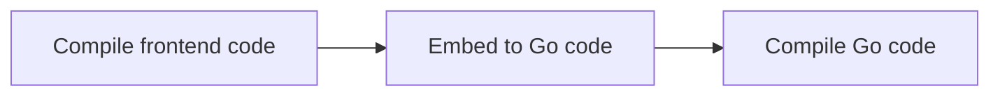

# Integrate Frontend Artifacts via Go Modules

The ability to compile into a single binary is a great feature of the Go programming language, avoiding dependency management at deployment time. However, if the project contains front-end code, we need to find a way to embed the front-end artifact into the Go binary at compile time. The compilation process is as follows.



1. Compile the front-end code.
2. Convert front-end artifacts to Go embedding files. For example, the project [rakyll/statik](https://github.com/rakyll/statik) is able to embed any file into the Go source code. In addition, the Go language currently provides an official embedding solution [embed](https://pkg.go.dev/embed) that allows embedding to be done during compilation, eliminating step 2.
3. Build Go code.

Usually front-end code and Go code are placed in the same repository or put into the Go repository through git submodule and compiled through Makefile or build scripts. But such a solution has a small drawback, we need to install the front-end toolchain when developing a Go project. *For a project like Gorse, most of the development work is on the backend, and the front-end changes are very minimal. It is unnecessary to compile the front-end every time the repository is pulled, so a solution is needed to avoid the front-end compilation process during Go development.* The [Gorse](https://gorse.io/) project compiles the dashboard front-end code into a separate Go package that is integrated into the main repository via Go modules.

## Compile Front-end into Go Packages

[rakyll/statik](https://github.com/rakyll/statik) can embed front-end artifacts into Go code, then it is perfectly possible to have the converted code referenced by Gorse as a separate Go package. Then after each modification of the front-end code:

1. Compile the front-end code.
2. Use [rakyll/statik](https://github.com/rakyll/statik) to convert front-end artifacts to Go embedding files and initialize Go packages with `go mod init` and `go mod tidy`.
3. Push the Go package to the repository or branch used to store the artifact.

The above process can be written as a script, and since the [Gorse front-end repository](https://github.com/gorse-io/dashboard) is hosted on GitHub, it can be automatically updated each time the front-end code is committed through GitHub Action.

```yaml
name: build

on:
  push:
    branches: [ master ] # Triggered when master commits code

jobs:
  build:
    runs-on: ubuntu-latest
    steps:
      # Compile front-end code
      - uses: actions/checkout@v2
      - name: Install dependencies
        uses: borales/actions-yarn@v2.0.0
        with:
          cmd: install
      - name: Build for production
        uses: borales/actions-yarn@v2.0.0
        with:
          cmd: build
      # Embed into Go source code
      - name: Install Go
        uses: actions/setup-go@v2
      - name: Install statik & build embed files
        run: |
          export PATH=$PATH:$(go env GOPATH)/bin
          go get github.com/rakyll/statik
          statik -src=dist
      # Commit Go source code
      - name: Commit embed files
        run: |
          cd ...
          git clone https://github.com/gorse-io/dashboard.git dashboard-statik
          cd dashboard-statik
          git config --local user.email "41898282+github-actions[bot]@users.noreply.github.com"
          git config --local user.name "github-actions[bot]"
          git checkout statik || git checkout --orphan statik
          git rm -r --cached .
          rm statik.go go.mod go.sum
          cp -f ... /dashboard/statik/statik.go statik.go
          go mod init github.com/gorse-io/dashboard
          go mod tidy
          git add statik.go go.mod go.sum
          git commit -m "Build embed files"
          git remote-set-url origin https://x-access-token:${{ secrets.GITHUB_TOKEN }}@github.com/${{ github.repository }}
          git push origin statik
```

The above GitHub Action commits the Go code to the [statik](https://github.com/gorse-io/dashboard/tree/statik) branch.

## Using Front-end Artifacts via Go Modules

First, download the front-end artifact package. Since the product is stored on the [statik](https://github.com/gorse-io/dashboard/tree/statik) branch, you need to add `@statik` after the package name.

```
go get -u github.com/gorse-io/dashboard@statik
```

Then, `github.com/gorse-io/dashboard` is imported and the front-end static files are saved in the filesystem created by `fs.New()`.

```go
import (
  "github.com/rakyll/statik/fs"
  _ "github.com/gorse-io/dashboard"
)

  // ...

  statikFS, err := fs.New()
  if err ! = nil {
    log.Fatal(err)
  }
  
  // Example: Accessing the file system via HTTP
  http.Handle("/", http.FileServer(statikFS))
  http.ListenAndServe(":8080", nil)
```

## Summary

Using Go modules to manage front-end artifacts is elegant, but only suitable for projects with few front-end changes. For projects where front-end and back-end development often needs joint debugging, such as mall projects, it is more appropriate to put the front-end and back-end code in the same repository.
