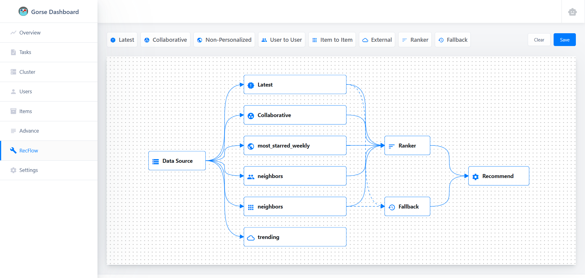
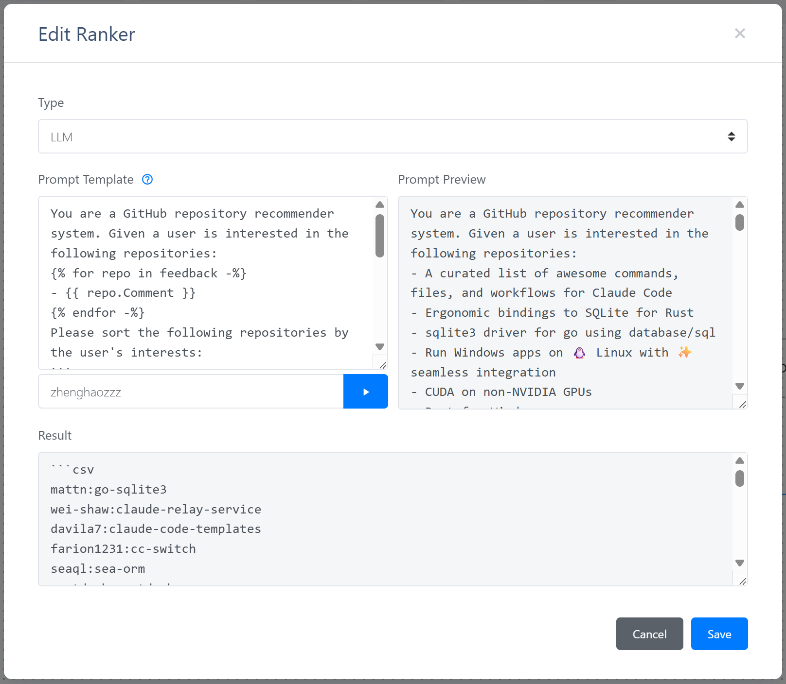

# Build Recommender System with LLM Ranker

Gorse implemented [visual recommendation flow editor](../docs/dashboard/recflow.md) and [Large Language Model (LLM) ranker](../docs/concepts/ranking.md) during versions [v0.5.2](https://github.com/gorse-io/gorse/releases/tag/v0.5.2) to [v0.5.4](https://github.com/gorse-io/gorse/releases/tag/v0.5.4). This article introduces how to combine these two features to create a recommendation flow that uses an LLM ranker via the RecFlow editor.

## Preparation

First, you need to prepare an LLM service compatible with the OpenAI API. At the time of writing, [NVIDIA](https://build.nvidia.com/) provides free large model inference services worth trying.

If you have already deployed the Gorse recommender system, taking [NVIDIA](https://build.nvidia.com/) as an example, you need to add the API endpoint, API key, and model name to the following fields in the configuration file:

```toml
[openai]

# Base URL of OpenAI API.
base_url = "https://integrate.api.nvidia.com/v1"

# API key of OpenAI API.
auth_token = "NVIDIA_API_KEY"

# Name of chat completion model.
chat_completion_model = "openai/gpt-oss-120b"
```

You can also override these fields via environment variables:

```bash
OPENAI_BASE_URL="https://integrate.api.nvidia.com/v1"
OPENAI_AUTH_TOKEN="NVIDIA_API_KEY"
OPENAI_CHAT_COMPLETION_MODEL="openai/gpt-oss-120b"
```

If you haven't deployed Gorse yet, don't worry. You can start a temporary Gorse instance to experience these features:

```bash
docker run -p 8088:8088 
  -e OPENAI_BASE_URL="https://integrate.api.nvidia.com/v1" 
  -e OPENAI_AUTH_TOKEN="NVIDIA_API_KEY" 
  -e OPENAI_CHAT_COMPLETION_MODEL="openai/gpt-oss-120b" 
  zhenghaoz/gorse-in-one --playground
```

## RecFlow Editor

Open the dashboard (default port `8088`), click *RecFlow* in the left navigation bar to enter the RecFlow editor:



The starting point of the recommendation flow is the *Data Source* node, and the end point is the *Recommend* node. For detailed node introductions, please refer to the [RecFlow documentation](../docs/dashboard/recflow.md). In this article, we only care about the LLM-based *Ranker* node. Due to context length limitations, LLMs cannot rank all items, so first, candidate items must be collected by multiple recommenders (such as collaborative filtering, item-to-item, etc.). These candidate items are merged and then sorted by the *Ranker* node.

Double-click the *Ranker* node, select the type as *LLM*, and you will see the LLM ranker configuration interface:



LLM ranker requires a prompt template. It uses historical feedback and candidate items to render the Jinja2 template, and then sends the rendered prompt to the LLM. The model's return format is required to be CSV, with each line containing an item ID. After entering a user ID and clicking the run button, the dashboard will read the user's recent feedback and the latest items, render the prompt using the template, and send the rendered prompt to the LLM.

After saving the recommendation flow, Gorse will load the recommendation flow defined by the RecFlow editor instead of the one in the configuration file. Fallback nodes are particularly important for LLM ranker. When the LLM cannot provide ranking services, Gorse will use the recommendation from the fallback node.

## Evaluation

The preview in the dashboard is used to ensure that the LLM can return the correct format, but the ranking performance needs to be evaluated using the *gorse-cli* tool.

1. Compile [gorse-cli](https://github.com/gorse-io/gorse/tree/master/cmd/gorse-cli) from Gorse repository.
2. *gorse-cli* temporarily does not support recommendation flows defined by the RecFlow editor, so the recommendation workflow configuration needs to be written into the configuration file. Additionally, database access methods also need to be provided via the configuration file or environment variables.
3. Run the following command to evaluate the performance of a LLM ranker:

```bash
./gorse-cli bench-llm --config config.toml -s 1
```

The `-s` parameter specifies the number of training samples per user. When splitting the training and test sets, for each user, feedback is first sorted by time from newest to oldest. The latest feedback is taken as the test set, the subsequent `s` feedback entries are used as the training set, and the remaining feedback is not involved in training. When evaluating ranking performance, for each user, 99 unseen items are randomly selected to be ranked together with the test set item. NDCG@10 is calculated; a higher value indicates better ranking performance.

The evaluation results of collaborative filtering and various LLMs on the playground dataset are plotted as follows:

::: echarts LLM Ranking Performance Benchmark

```json
{
  "legend": {
    "data": ["Collaborative Filtering", "gpt-oss-120b", "deepseek-v3.2"]
  },
  "xAxis": {
    "name": "Shots",
    "data": [1, 5, 10, 20, 50]
  },
  "yAxis": {
    "name": "NDCG@10",
    "type": "value"
  },
  "tooltip": {
    "trigger": "item",
    "formatter": "{c}"
  },
  "series": [
    {
      "name": "Collaborative Filtering",
      "data": [0.1454, 0.2130, 0.2671, 0.2895, 0.3082],
      "type": "bar"
    },
    {
      "name": "gpt-oss-120b",
      "data": [0.2509, 0.2802, 0.2998, 0.3086, 0.3060],
      "type": "bar"
    },
    {
      "name": "deepseek-v3.2",
      "data": [0.2595, 0.2873, 0.3084, 0.3140, 0.3207],
      "type": "bar"
    }
  ]
}
```
:::

This benchmark compares the NDCG@10 of three rankers: collaborative filtering (matrix factorization), gpt-oss-120b, and deepseek-v3.2 under different numbers of training samples. LLMs are significantly superior to collaborative filtering when the number of training samples is small. As the number of training samples increases, the gap between collaborative filtering and LLMs gradually narrows. When the sample count reaches 50, the ranking accuracy metric of collaborative filtering is already higher than that of gpt-oss-120b, but still lower than deepseek-v3.2. The experimental results reveal the following insights for using LLM rankers:

1. LLMs have a significant advantage in cold-start and can effectively improve the ranking performance of recommender systems.
2. For ranking tasks, using an LLM with 120B parameters can already achieve good results; improvements from LLMs with larger parameters are limited.
3. As training data accumulates, the advantage of LLM ranker gradually diminishes, and suitable ranker should be selected based on benchmark results.

::: note Where is the CTR prediction model?
Readers may notice that the Click-Through Rate (CTR) prediction model, which is responsible for ranking tasks, does not appear in the comparison in this benchmark. This is because the CTR prediction model predicts the probability of a user clicking (generating positive feedback) and is not optimized for ranking tasks, so evaluating CTR prediction models using ranking metrics is unfair. Comparing collaborative filtering with LLM ranking is a last resort, but it is enough to demonstrate the potential of LLM ranker in recommender systems.
:::

## Future Work

This article is a preliminary exploration of LLM ranker. We will subsequently benchmark more LLMs in more datasets using more metrics. In the future, we will also explore whether fine-tuning small and medium-sized LLMs can further improve their ranking capabilities.
