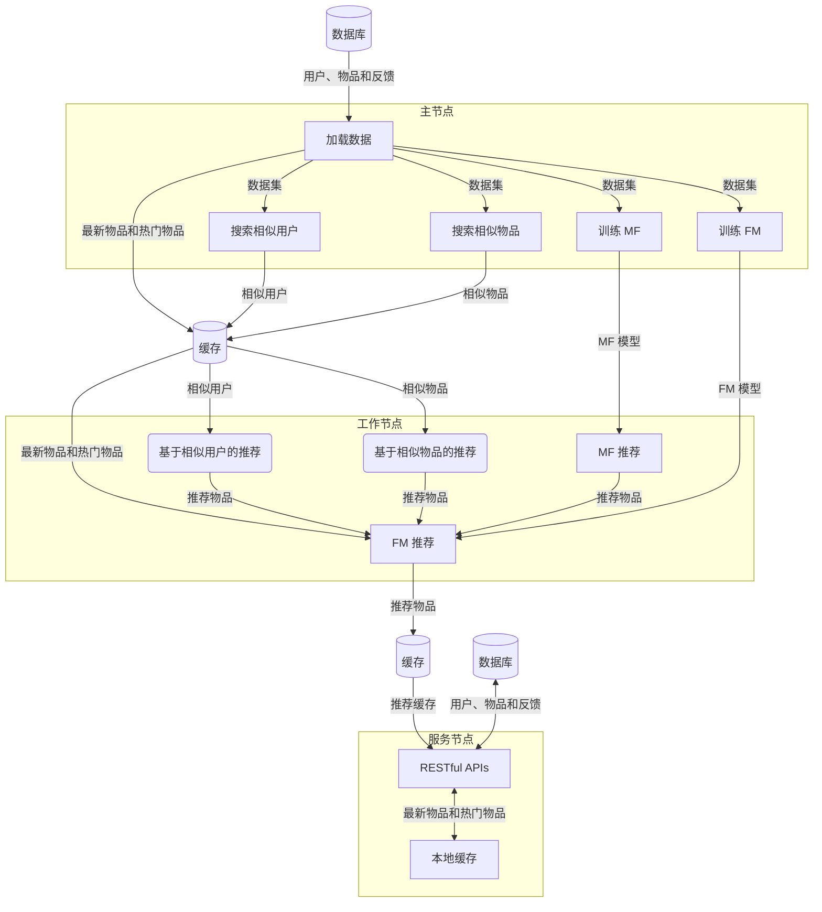
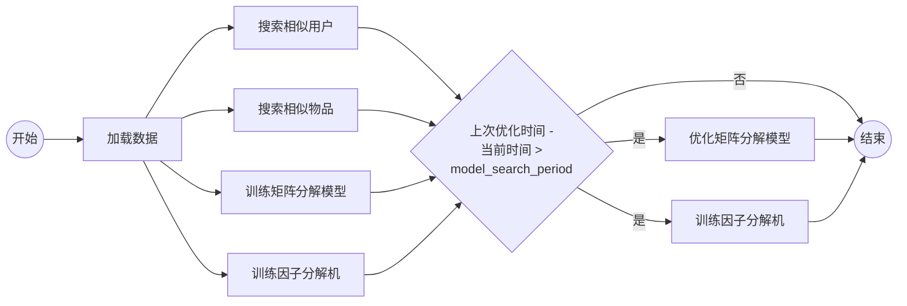
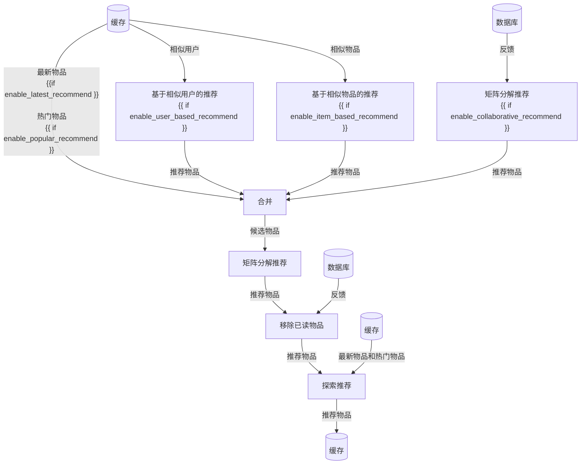
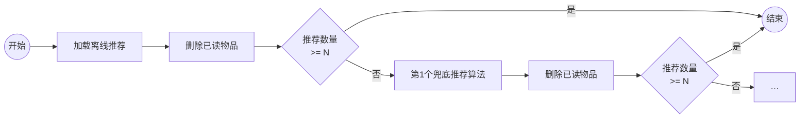
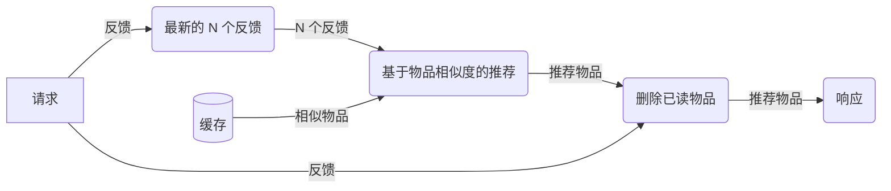

# 推荐流程

Gorse 的工作流程如下图所示：



<fonticon icon="rectangle"></fonticon>表示每个节点中的组件或者任务。

## 架构

主节点从数据库中加载数据。在加载数据的过程中，热门物品和最新物品被写入缓存。然后，主节点搜索相似物品和相似用户并训练推荐模型。同时主节点会在后台随机搜索寻找当前数据的最佳推荐模型参数。工作节点从主节点拉取推荐模型并为每个用户生成离线推荐。服务节点提供 RESTful APIs。工作节点和服务节点通过 GRPC 连接到主节点，需要在配置文件中配置 IP 和端口。

```toml
[master]

# GRPC port of the master node. The default value is 8086.
port = 8086

# gRPC host of the master node. The default values is "0.0.0.0".
host = "0.0.0.0"

# Number of working jobs in the master node. The default value is 1.
n_jobs = 1

# Meta information timeout. The default value is 10s.
meta_timeout = "10s"
```

主节点的工作线程数由`master.n_jobs`设置。对于工作节点的线程数量由命令行参数设置。

## 推荐流程

Gorse 像瀑布一样工作。用户、物品和反馈是水的源头。中间结果被缓存在缓存存储（例如 Redis）中，就像从第一个瀑布落下的水被缓存在中间的水池中。经过几个阶段后，将选定的物品推荐给用户。

::: center

[](https://www.google.com.hk/maps/place/9494%2B2XX+Sanzhe+Pujingqu,+Xueshi+Rd,+Yueqing,+Wenzhou,+Zhejiang,+China,+325613/@28.367624,121.1074902,17z/data=!4m14!1m7!3m6!1s0x344fb1c336f6089f:0x289b31d5bd3c5903!2zQ2hpbmEsIFpoZWppYW5nLCBXZW56aG91LCBZdWVxaW5nLCDpm4HojaHplYfkuInmipjngJE!8m2!3d28.372423!4d121.091304!16s%2Fg%2F1tlqmqj3!3m5!1s0x344fb1be99ca855b:0x1d80848a11ae084d!8m2!3d28.367624!4d121.1074902!16s%2Fg%2F1tm8bqtb)

:::

中间结果缓存是可配置的。增加缓存的大小可以提升推荐准确率，因为推荐系统包含更多的信息，但也会消耗更多的缓存存储空间。缓存的过期时间应该在新鲜度和计算成本之间进行权衡。

```toml
[recommend]

# The cache size for recommended/popular/latest items. The default value is 10.
cache_size = 100

# Recommended cache expire time. The default value is 72h.
cache_expire = "72h"
```

推荐流程将以自上而下的方式介绍。

### 主节点：寻找相似和模型训练

主节点由数据加载驱动。数据加载发生在每个`model_fit_period`周期中。加载数据的同时会收集最新的物品和流行的物品。加载完数据后，将启动以下任务。

- **查找相似：** 找到并缓存相似用户和相似物品。
- **训练模型：** 矩阵分解模型和因子分解机模型经过训练后推送给工作节点。
- **优化模型：** 在每个`model_search_period`周期中，主节点使用随机搜索优化MF和FM。模型搜索器将产生`model_search_trials`种参数组合，在`model_search_epoch`迭代期间具有最佳得分的模型被用于下一轮模型训练。在大多数情况下，没有必要改变这两个选项值。默认情况下，模型大小是固定的，设置`enable_model_size_search`来搜索更大的模型，当然这样会消耗更多的内存。

```toml
[recommend.collaborative]

# The time period for model fitting. The default value is "60m".
model_fit_period = "60m"

# The time period for model searching. The default value is "360m".
model_search_period = "360m"

# The number of epochs for model searching. The default value is 100.
model_search_epoch = 100

# The number of trials for model searching. The default value is 10.
model_search_trials = 10

# Enable searching models of different sizes, which consume more memory. The default value is false.
enable_model_size_search = false
```

一旦数据被加载好，相似物品（用户）搜索和模型训练就会并行开始。在相似物品（用户）搜索和模型训练结束后，如果前一次优化时间是`model_search_period`之前，则开始模型优化任务。



### 工作节点：离线推荐

工作节点生成并向缓存数据库写入离线推荐。工作节点在每个`check_recommend_period`周期中检查每个用户。如果一个用户的最后活跃时间晚于其最新的离线推荐缓存，或者该缓存在`refresh_recommend_period`之前被生成，工作节点会刷新该用户的离线推荐。



首先，工作节点从最新物品、热门物品、基于用户相似性的推荐、基于物品相似性的推荐和矩阵分解推荐中收集候选物品。候选物品的来源可以在配置中启用或禁用。然后，通过因子分解机对候选物品进行排名，并删除已读物品。如果`enable_click_through_prediction`是`false`，则候选物品会被随机排序。最后，热门的物品和最新的物品将以`explore_recommend`中定义的概率被注入到推荐中。离线推荐结果将被写入到缓存。

```toml
[recommend.offline]

# The time period to check recommendation for users. The default values is 1m.
check_recommend_period = "1m"

# The time period to refresh recommendation for inactive users. The default values is 120h.
refresh_recommend_period = "24h"

# Enable latest recommendation during offline recommendation. The default value is false.
enable_latest_recommend = true

# Enable popular recommendation during offline recommendation. The default value is false.
enable_popular_recommend = false

# Enable user-based similarity recommendation during offline recommendation. The default value is false.
enable_user_based_recommend = true

# Enable item-based similarity recommendation during offline recommendation. The default value is false.
enable_item_based_recommend = false

# Enable collaborative filtering recommendation during offline recommendation. The default value is true.
enable_collaborative_recommend = true

# Enable click-though rate prediction during offline recommendation. Otherwise, results from multi-way recommendation
# would be merged randomly. The default value is false.
enable_click_through_prediction = true

# The explore recommendation method is used to inject popular items or latest items into recommended result:
#   popular: Recommend popular items to cold-start users.
#   latest: Recommend latest items to cold-start users.
# The default values is { popular = 0.0, latest = 0.0 }.
explore_recommend = { popular = 0.1, latest = 0.2 }
```

### 服务节点：在线推荐

服务器节点为数据操作和推荐提供 RESTful API。

#### 数据API

数据 API 为用户、物品和反馈提供 CRUD。插入反馈时，用户和物品必须已经存在。配置中有选项可以在插入反馈的时候自动插入用户或物品，或者忽略包含不存在的用户或物品的反馈。

```toml
[server]

# Insert new users while inserting feedback. The default value is true.
auto_insert_user = true

# Insert new items while inserting feedback. The default value is true.
auto_insert_item = true
```

#### 推荐API

推荐 API 用于返回推荐结果。对于非个性化推荐（最新项目、热门物、相似用户和相似物品），服务器节点从缓存数据库中获取推荐然后发送响应。但是对于个性化推荐，服务节点需要做更多的工作。

- **个性化推荐：** 首先拉取工作节点产生的离线推荐，然后将已读物品删除。但如果离线推荐缓存被消耗完了，将使用兜底推荐算法。也就是从前往后尝试`fallback_recommend`中的推荐算法。



- **会话推荐：** 会话推荐器根据用户会话中的反馈，为未注册用户生成推荐。会话推荐是由基于最新的$n$个反馈，通过基于物品相似性的推荐算法产生，反馈中的已读物品将从推荐中删除。使用的用户反馈的数量由`num_feedback_fallback_item_based`设置。



```toml
[recommend.online]

# The fallback recommendation method is used when cached recommendation drained out:
#   item_based: Recommend similar items.
#   popular: Recommend popular items.
#   latest: Recommend latest items.
# Recommenders are used in order. The default values is ["latest"].
fallback_recommend = ["item_based", "latest"]

# The number of feedback used in fallback item-based similar recommendation. The default values is 10.
num_feedback_fallback_item_based = 10
```

除了推荐之外，还有两个重要的服务节点配置项。

- **时钟误差：** Gorse 支持带有未来时间戳的反馈，因此 Gorse 依赖于一个正确的时钟。然而，不同主机的时钟可能不同，`clock_error`是各个节点时钟之间的最大误差。
- **缓存过期时间：** 服务节点将隐藏的物品和热门物品缓存在本地缓存中，以避免过于频繁地访问外部数据库。本地缓存每隔`cache_expire`都会被刷新。

```toml
[server]

# Clock error in the cluster. The default value is 5s.
clock_error = "5s"

# Server-side cache expire time. The default value is 10s.
cache_expire = "10s"
```

### 放回

在某些情况下，已读物品应该被再次推荐给用户，但其权重应该比首次推荐较低。如果`enable_replacement`被开启，已读物品将被放回到推荐池中。正向反馈和已读反馈的权重衰减因素由`positive_replacement_decay`和`read_replacement_decay`控制。

```toml
[recommend.replacement]

# Replace historical items back to recommendations.
enable_replacement = false

# Decay the weights of replaced items from positive feedbacks.
positive_replacement_decay = 0.8

# Decay the weights of replaced items from read feedbacks.
read_replacement_decay = 0.6
```
