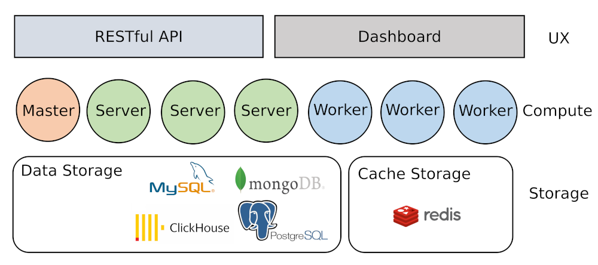

# Introduction

Gorse是以go语言编写的开源推荐系统。Gorse旨在成为一个便于集成各类在线服务的通用的开源推荐系统。通过导入物品、用户和交互数据，Gorse会自动训练模型并为每个用户生成推荐。项目的特点如下。

- **多源推荐:** 对于用户来说，推荐物品是从不同的方式收集的（热门的、最新的、基于用户的、基于物品的和协同过滤），并根据点击率预测进行排名。
- **自动机器学习:** 通过后台模型搜索，自动选择最佳推荐模型和策略。
- **分布式推荐:** 单节点训练，分布式预测，推荐阶段实现水平伸缩的能力。
- **RESTful API:** 为数据CRUD和推荐请求提供RESTful API。
- **仪表盘:** 提供数据导入导出、监控、集群状态检查等功能。

Gorse是一个单节点训练和分布式预测推荐系统。数据存储在MySQL、MongoDB、PostgresSQL或ClickHouse中，中间数据缓存在Redis中。

1. 集群由一个主节点（Master）、多个工作节点（Worker）和服务节点（Server）组成。
2. 主节点负责模型训练、非个性化项目推荐、配置管理和用户管理。
3. 服务器节点负责暴露RESTful API和在线实时推荐。
4. 工作节点负责为每个用户提供离线推荐。

此外，管理员还可以通过主节点的仪表板进行系统监控、数据导入导出、系统状态检查等操作。

