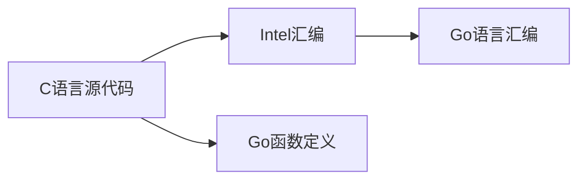

# 在Go语言中优雅地使用AVX512

AVX512是英特尔发布的最新最新一代SIMD指令，能够在一个指令周期内对512位数据进行处理，相当于16个单精度浮点数或者8个双精度浮点数。Gorse推荐系统中的推荐模型训练和推理过程需要大量的向量计算工作，AVX512理论上能够带来一定的加速效果。然而比较遗憾的是，Go语言的编译器并不能自动生成使用SIMD指令的机器码。

[MinIO](https://github.com/minio)曾经开源过一个将英特尔汇编转换为Go汇编的工具[c2goasm](https://github.com/minio/c2goasm)。首先，将需要向量化的函数用C语言实现，通过Clang编译出包含SIMD指令的汇编。然后，由于[Go汇编](https://go.dev/doc/asm)是[支持AVX512](https://github.com/golang/go/wiki/AVX512)的，将Intel汇编指令转换成Go汇编，即可通过汇编调用SIMD实现的函数。c2goasm的方案十分有效，然而项目已经将近4年没有更新，经过测试也无法处理AVX512指令。

为能够在Go语言中使用AVX512，我们开发了一个将C语言编译为Go汇编函数的工具包[goat](https://github.com/gorse-io/gorse/tree/master/cmd/goat)，借助goat实现了一个向量化函数库[github.com/gorse-io/gorse/base/floats](https://github.com/gorse-io/gorse/tree/master/base/floats)。在继承c2goasm技术路线的基础上，goat实现了功能上进一步的增强：

1. 从C语言源代码直接开始转换得到Go汇编函数，用户不必自行编译C语言源代码；
2. 同时会根据C语言函数定义生成Go函数定义，用户不需要手写Go函数定义。

接下来的篇幅会详细介绍goat的技术实现思路，具体的实现欢迎阅读代码[github.com/gorse-io/gorse/cmd/goat](https://github.com/gorse-io/gorse/tree/master/cmd/goat)。



## 从C语言编译汇编代码

C语言实现的函数`_mm512_mul_to`将两个浮点数组相乘之后，将结果保存到第三个数组中。一般情况下，编译器会自动生成使用SIMD的汇编，此处使用了intrinsic确保一定生成SIMD指令。

```c
#include <immintrin.h>

void _mm512_mul_to(float *a, float *b, float *c, int64_t n)
{
    int epoch = n / 16;
    int remain = n % 16;
    for (int i = 0; i < epoch; i++)
    {
        __m512 v1 = _mm512_loadu_ps(a);
        __m512 v2 = _mm512_loadu_ps(b);
        __m512 v = _mm512_mul_ps(v1, v2);
        _mm512_storeu_ps(c, v);
        a += 16;
        b += 16;
        c += 16;
    }
    if (remain >= 8)
    {
        __m256 v1 = _mm256_loadu_ps(a);
        __m256 v2 = _mm256_loadu_ps(b);
        __m256 v = _mm256_mul_ps(v1, v2);
        _mm256_storeu_ps(c, v);
        a += 8;
        b += 8;
        c += 8;
        remain -= 8;
    }
    for (int i = 0; i < remain; i++)
    {
        c[i] = a[i] * b[i];
    }
}
```

将代码保存到`mm512_mul_to.c`，使用以下命令将C代码编译为汇编以及二进制。

```bash
# 生成汇编
clang -S -c mm512_mul_to.c -o mm512_mul_to.s \
  -mno-red-zone -mstackrealign -mllvm -inline-threshold=1000 \
  -fno-asynchronous-unwind-tables -fno-exceptions -fno-rtti

# 生成二进制
clang -c mm512_mul_to.c -o mm512_mul_to.o \
  -mno-red-zone -mstackrealign -mllvm -inline-threshold=1000 \
  -fno-asynchronous-unwind-tables -fno-exceptions -fno-rtti
```

在Go语言中，可以用`exec.Command`很方便地执行编译命令。

## 从汇编代码构造Go代码

### 转换汇编代码

`mm512_mul_to.o`是函数被编译后的二进制，通过`objdump`可以看到每条汇编都被转换成了机器码。

```bash
objdump -d mm512_mul_to.o --insn-width 16
```

::: details objdump输出内容

```
0000000000000460 <_mm512_mul_to>:
 460:   55                              push   %rbp
 461:   48 89 e5                        mov    %rsp,%rbp
 464:   48 83 e4 f8                     and    $0xfffffffffffffff8,%rsp
 468:   4c 8d 49 0f                     lea    0xf(%rcx),%r9
 46c:   48 85 c9                        test   %rcx,%rcx
 46f:   4c 0f 49 c9                     cmovns %rcx,%r9
 473:   49 c1 e9 04                     shr    $0x4,%r9
 477:   44 89 c8                        mov    %r9d,%eax
 47a:   c1 e0 04                        shl    $0x4,%eax
 47d:   29 c1                           sub    %eax,%ecx
 47f:   45 85 c9                        test   %r9d,%r9d
 482:   0f 8e bc 00 00 00               jle    544 <_mm512_mul_to+0xe4>
 488:   41 8d 41 ff                     lea    -0x1(%r9),%eax
 48c:   45 89 c8                        mov    %r9d,%r8d
 48f:   41 83 e0 03                     and    $0x3,%r8d
 493:   83 f8 03                        cmp    $0x3,%eax
 496:   72 74                           jb     50c <_mm512_mul_to+0xac>
 498:   41 83 e1 fc                     and    $0xfffffffc,%r9d
 49c:   41 f7 d9                        neg    %r9d
 49f:   90                              nop
 4a0:   62 f1 7c 48 10 07               vmovups (%rdi),%zmm0
 4a6:   62 f1 7c 48 59 06               vmulps (%rsi),%zmm0,%zmm0
 4ac:   62 f1 7c 48 11 02               vmovups %zmm0,(%rdx)
 4b2:   62 f1 7c 48 10 47 01            vmovups 0x40(%rdi),%zmm0
 4b9:   62 f1 7c 48 59 46 01            vmulps 0x40(%rsi),%zmm0,%zmm0
 4c0:   62 f1 7c 48 11 42 01            vmovups %zmm0,0x40(%rdx)
 4c7:   62 f1 7c 48 10 47 02            vmovups 0x80(%rdi),%zmm0
 4ce:   62 f1 7c 48 59 46 02            vmulps 0x80(%rsi),%zmm0,%zmm0
 4d5:   62 f1 7c 48 11 42 02            vmovups %zmm0,0x80(%rdx)
 4dc:   62 f1 7c 48 10 47 03            vmovups 0xc0(%rdi),%zmm0
 4e3:   62 f1 7c 48 59 46 03            vmulps 0xc0(%rsi),%zmm0,%zmm0
 4ea:   62 f1 7c 48 11 42 03            vmovups %zmm0,0xc0(%rdx)
 4f1:   48 81 c7 00 01 00 00            add    $0x100,%rdi
 4f8:   48 81 c6 00 01 00 00            add    $0x100,%rsi
 4ff:   48 81 c2 00 01 00 00            add    $0x100,%rdx
 506:   41 83 c1 04                     add    $0x4,%r9d
 50a:   75 94                           jne    4a0 <_mm512_mul_to+0x40>
 50c:   45 85 c0                        test   %r8d,%r8d
 50f:   74 33                           je     544 <_mm512_mul_to+0xe4>
 511:   66 2e 0f 1f 84 00 00 00 00 00   nopw   %cs:0x0(%rax,%rax,1)
 51b:   0f 1f 44 00 00                  nopl   0x0(%rax,%rax,1)
 520:   62 f1 7c 48 10 07               vmovups (%rdi),%zmm0
 526:   62 f1 7c 48 59 06               vmulps (%rsi),%zmm0,%zmm0
 52c:   62 f1 7c 48 11 02               vmovups %zmm0,(%rdx)
 532:   48 83 c7 40                     add    $0x40,%rdi
 536:   48 83 c6 40                     add    $0x40,%rsi
 53a:   48 83 c2 40                     add    $0x40,%rdx
 53e:   41 83 c0 ff                     add    $0xffffffff,%r8d
 542:   75 dc                           jne    520 <_mm512_mul_to+0xc0>
 544:   83 f9 07                        cmp    $0x7,%ecx
 547:   7e 1b                           jle    564 <_mm512_mul_to+0x104>
 549:   c5 fc 10 07                     vmovups (%rdi),%ymm0
 54d:   c5 fc 59 06                     vmulps (%rsi),%ymm0,%ymm0
 551:   c5 fc 11 02                     vmovups %ymm0,(%rdx)
 555:   48 83 c7 20                     add    $0x20,%rdi
 559:   48 83 c6 20                     add    $0x20,%rsi
 55d:   48 83 c2 20                     add    $0x20,%rdx
 561:   83 c1 f8                        add    $0xfffffff8,%ecx
 564:   85 c9                           test   %ecx,%ecx
 566:   0f 8e ac 00 00 00               jle    618 <_mm512_mul_to+0x1b8>
 56c:   89 c9                           mov    %ecx,%ecx
 56e:   48 8d 41 ff                     lea    -0x1(%rcx),%rax
 572:   41 89 c8                        mov    %ecx,%r8d
 575:   41 83 e0 03                     and    $0x3,%r8d
 579:   48 83 f8 03                     cmp    $0x3,%rax
 57d:   73 04                           jae    583 <_mm512_mul_to+0x123>
 57f:   31 c0                           xor    %eax,%eax
 581:   eb 5b                           jmp    5de <_mm512_mul_to+0x17e>
 583:   83 e1 fc                        and    $0xfffffffc,%ecx
 586:   31 c0                           xor    %eax,%eax
 588:   0f 1f 84 00 00 00 00 00         nopl   0x0(%rax,%rax,1)
 590:   c5 fa 10 04 87                  vmovss (%rdi,%rax,4),%xmm0
 595:   c5 fa 59 04 86                  vmulss (%rsi,%rax,4),%xmm0,%xmm0
 59a:   c5 fa 11 04 82                  vmovss %xmm0,(%rdx,%rax,4)
 59f:   c5 fa 10 44 87 04               vmovss 0x4(%rdi,%rax,4),%xmm0
 5a5:   c5 fa 59 44 86 04               vmulss 0x4(%rsi,%rax,4),%xmm0,%xmm0
 5ab:   c5 fa 11 44 82 04               vmovss %xmm0,0x4(%rdx,%rax,4)
 5b1:   c5 fa 10 44 87 08               vmovss 0x8(%rdi,%rax,4),%xmm0
 5b7:   c5 fa 59 44 86 08               vmulss 0x8(%rsi,%rax,4),%xmm0,%xmm0
 5bd:   c5 fa 11 44 82 08               vmovss %xmm0,0x8(%rdx,%rax,4)
 5c3:   c5 fa 10 44 87 0c               vmovss 0xc(%rdi,%rax,4),%xmm0
 5c9:   c5 fa 59 44 86 0c               vmulss 0xc(%rsi,%rax,4),%xmm0,%xmm0
 5cf:   c5 fa 11 44 82 0c               vmovss %xmm0,0xc(%rdx,%rax,4)
 5d5:   48 83 c0 04                     add    $0x4,%rax
 5d9:   48 39 c1                        cmp    %rax,%rcx
 5dc:   75 b2                           jne    590 <_mm512_mul_to+0x130>
 5de:   4d 85 c0                        test   %r8,%r8
 5e1:   74 35                           je     618 <_mm512_mul_to+0x1b8>
 5e3:   48 8d 0c 82                     lea    (%rdx,%rax,4),%rcx
 5e7:   48 8d 14 86                     lea    (%rsi,%rax,4),%rdx
 5eb:   48 8d 04 87                     lea    (%rdi,%rax,4),%rax
 5ef:   31 f6                           xor    %esi,%esi
 5f1:   66 2e 0f 1f 84 00 00 00 00 00   nopw   %cs:0x0(%rax,%rax,1)
 5fb:   0f 1f 44 00 00                  nopl   0x0(%rax,%rax,1)
 600:   c5 fa 10 04 b0                  vmovss (%rax,%rsi,4),%xmm0
 605:   c5 fa 59 04 b2                  vmulss (%rdx,%rsi,4),%xmm0,%xmm0
 60a:   c5 fa 11 04 b1                  vmovss %xmm0,(%rcx,%rsi,4)
 60f:   48 83 c6 01                     add    $0x1,%rsi
 613:   49 39 f0                        cmp    %rsi,%r8
 616:   75 e8                           jne    600 <_mm512_mul_to+0x1a0>
 618:   48 89 ec                        mov    %rbp,%rsp
 61b:   5d                              pop    %rbp
 61c:   c5 f8 77                        vzeroupper 
 61f:   c3                              retq   
```

:::

#### 编码机器码

Go汇编提供了三种表示二进制机器码的指令：

- `BYTE`表示一个字节长度的二进制数据
- `WORD`表示两个字节长度的二进制数据
- `LONG`表示四个字节长度的二进制数据

如果指令机器码长度刚好是二的倍数，例如

```asm
 498:   41 83 e1 fc                     and    $0xfffffffc,%r9d
```

可以转换为

```asm
 LONG $0xfce18341
```

但是如果长度不是二的倍数，例如

```asm
 4b2:   62 f1 7c 48 10 47 01            vmovups 0x40(%rdi),%zmm0
```

就需要三种指令组合表示

```asm
 LONG $0x487cf162; WORD $0x4710; BYTE $0x01 // vmovups	64(%rdi), %zmm0
```

需要注意，指令编码的字节顺序和`objdump`输出的字节顺序是相反的。

#### 函数定义和参数

在C语言汇编中，如果函数的参数不超过6个，那么参数会被保存在寄存器中传递给函数，摆放顺序为：`%rdi`、`%rsi`、`%rdx`、`%rcx`、`%r8`和`%r9`。然而在Go汇编中，函数参数会放在从`FP`寄存器所保存地址开始的内存中，这就需要我们将内存中的参数移动到寄存器中。

`_mm512_mul_to`函数有四个参数，那么就需要在函数开始之前移动好4个参数：

```asm
TEXT ·_mm512_mul_to(SB), $0-32
  MOVQ a+0(FP), DI
  MOVQ b+8(FP), SI
  MOVQ c+16(FP), DX
  MOVQ n+24(FP), CX
```

函数定义由三部分构成：`TEXT`关键字、以`·`开始以`(SB)`结尾的名字，最后是参数内存大小32字节。汇编中并没有参数数量信息，需要从C语言函数定义中获取（参考[生成go函数定义](#生成go函数定义)）。

#### 重定向跳转指令

在x86中跳转指令跳转的是绝对地址，对跳转指令进行直接编码是无法工作的。因此，跳转指令需要转换为Go汇编中的跳转指令。

- **转换标签：** Go汇编的标签不能以`.`开始，因此需要将`.`删除；
- **转换命令：** Go汇编的跳转指令是大写的。

经过上述三步骤处理，最终得到Go汇编代码

::: details Go汇编

```asm
TEXT ·_mm512_mul_to(SB), $0-32
 MOVQ a+0(FP), DI
 MOVQ b+8(FP), SI
 MOVQ c+16(FP), DX
 MOVQ n+24(FP), CX
 BYTE $0x55               // pushq %rbp
 WORD $0x8948; BYTE $0xe5 // movq %rsp, %rbp
 LONG $0xf8e48348         // andq $-8, %rsp
 LONG $0x0f498d4c         // leaq 15(%rcx), %r9
 WORD $0x8548; BYTE $0xc9 // testq %rcx, %rcx
 LONG $0xc9490f4c         // cmovnsq %rcx, %r9
 LONG $0x04e9c149         // shrq $4, %r9
 WORD $0x8944; BYTE $0xc8 // movl %r9d, %eax
 WORD $0xe0c1; BYTE $0x04 // shll $4, %eax
 WORD $0xc129             // subl %eax, %ecx
 WORD $0x8545; BYTE $0xc9 // testl %r9d, %r9d
 JLE  LBB3_6
 LONG $0xff418d41         // leal -1(%r9), %eax
 WORD $0x8945; BYTE $0xc8 // movl %r9d, %r8d
 LONG $0x03e08341         // andl $3, %r8d
 WORD $0xf883; BYTE $0x03 // cmpl $3, %eax
 JB   LBB3_4
 LONG $0xfce18341         // andl $-4, %r9d
 WORD $0xf741; BYTE $0xd9 // negl %r9d

LBB3_3:
 LONG $0x487cf162; WORD $0x0710             // vmovups (%rdi), %zmm0
 LONG $0x487cf162; WORD $0x0659             // vmulps (%rsi), %zmm0, %zmm0
 LONG $0x487cf162; WORD $0x0211             // vmovups %zmm0, (%rdx)
 LONG $0x487cf162; WORD $0x4710; BYTE $0x01 // vmovups 64(%rdi), %zmm0
 LONG $0x487cf162; WORD $0x4659; BYTE $0x01 // vmulps 64(%rsi), %zmm0, %zmm0
 LONG $0x487cf162; WORD $0x4211; BYTE $0x01 // vmovups %zmm0, 64(%rdx)
 LONG $0x487cf162; WORD $0x4710; BYTE $0x02 // vmovups 128(%rdi), %zmm0
 LONG $0x487cf162; WORD $0x4659; BYTE $0x02 // vmulps 128(%rsi), %zmm0, %zmm0
 LONG $0x487cf162; WORD $0x4211; BYTE $0x02 // vmovups %zmm0, 128(%rdx)
 LONG $0x487cf162; WORD $0x4710; BYTE $0x03 // vmovups 192(%rdi), %zmm0
 LONG $0x487cf162; WORD $0x4659; BYTE $0x03 // vmulps 192(%rsi), %zmm0, %zmm0
 LONG $0x487cf162; WORD $0x4211; BYTE $0x03 // vmovups %zmm0, 192(%rdx)
 LONG $0x00c78148; WORD $0x0001; BYTE $0x00 // addq $256, %rdi
 LONG $0x00c68148; WORD $0x0001; BYTE $0x00 // addq $256, %rsi
 LONG $0x00c28148; WORD $0x0001; BYTE $0x00 // addq $256, %rdx
 LONG $0x04c18341                           // addl $4, %r9d
 JNE  LBB3_3

LBB3_4:
 WORD $0x8545; BYTE $0xc0 // testl %r8d, %r8d
 JE   LBB3_6

LBB3_5:
 LONG $0x487cf162; WORD $0x0710 // vmovups (%rdi), %zmm0
 LONG $0x487cf162; WORD $0x0659 // vmulps (%rsi), %zmm0, %zmm0
 LONG $0x487cf162; WORD $0x0211 // vmovups %zmm0, (%rdx)
 LONG $0x40c78348               // addq $64, %rdi
 LONG $0x40c68348               // addq $64, %rsi
 LONG $0x40c28348               // addq $64, %rdx
 LONG $0xffc08341               // addl $-1, %r8d
 JNE  LBB3_5

LBB3_6:
 WORD $0xf983; BYTE $0x07 // cmpl $7, %ecx
 JLE  LBB3_8
 LONG $0x0710fcc5         // vmovups (%rdi), %ymm0
 LONG $0x0659fcc5         // vmulps (%rsi), %ymm0, %ymm0
 LONG $0x0211fcc5         // vmovups %ymm0, (%rdx)
 LONG $0x20c78348         // addq $32, %rdi
 LONG $0x20c68348         // addq $32, %rsi
 LONG $0x20c28348         // addq $32, %rdx
 WORD $0xc183; BYTE $0xf8 // addl $-8, %ecx

LBB3_8:
 WORD $0xc985             // testl %ecx, %ecx
 JLE  LBB3_14
 WORD $0xc989             // movl %ecx, %ecx
 LONG $0xff418d48         // leaq -1(%rcx), %rax
 WORD $0x8941; BYTE $0xc8 // movl %ecx, %r8d
 LONG $0x03e08341         // andl $3, %r8d
 LONG $0x03f88348         // cmpq $3, %rax
 JAE  LBB3_15
 WORD $0xc031             // xorl %eax, %eax
 JMP  LBB3_11

LBB3_15:
 WORD $0xe183; BYTE $0xfc // andl $-4, %ecx
 WORD $0xc031             // xorl %eax, %eax

LBB3_16:
 LONG $0x0410fac5; BYTE $0x87   // vmovss (%rdi,%rax,4), %xmm0
 LONG $0x0459fac5; BYTE $0x86   // vmulss (%rsi,%rax,4), %xmm0, %xmm0
 LONG $0x0411fac5; BYTE $0x82   // vmovss %xmm0, (%rdx,%rax,4)
 LONG $0x4410fac5; WORD $0x0487 // vmovss 4(%rdi,%rax,4), %xmm0
 LONG $0x4459fac5; WORD $0x0486 // vmulss 4(%rsi,%rax,4), %xmm0, %xmm0
 LONG $0x4411fac5; WORD $0x0482 // vmovss %xmm0, 4(%rdx,%rax,4)
 LONG $0x4410fac5; WORD $0x0887 // vmovss 8(%rdi,%rax,4), %xmm0
 LONG $0x4459fac5; WORD $0x0886 // vmulss 8(%rsi,%rax,4), %xmm0, %xmm0
 LONG $0x4411fac5; WORD $0x0882 // vmovss %xmm0, 8(%rdx,%rax,4)
 LONG $0x4410fac5; WORD $0x0c87 // vmovss 12(%rdi,%rax,4), %xmm0
 LONG $0x4459fac5; WORD $0x0c86 // vmulss 12(%rsi,%rax,4), %xmm0, %xmm0
 LONG $0x4411fac5; WORD $0x0c82 // vmovss %xmm0, 12(%rdx,%rax,4)
 LONG $0x04c08348               // addq $4, %rax
 WORD $0x3948; BYTE $0xc1       // cmpq %rax, %rcx
 JNE  LBB3_16

LBB3_11:
 WORD $0x854d; BYTE $0xc0 // testq %r8, %r8
 JE   LBB3_14
 LONG $0x820c8d48         // leaq (%rdx,%rax,4), %rcx
 LONG $0x86148d48         // leaq (%rsi,%rax,4), %rdx
 LONG $0x87048d48         // leaq (%rdi,%rax,4), %rax
 WORD $0xf631             // xorl %esi, %esi

LBB3_13:
 LONG $0x0410fac5; BYTE $0xb0 // vmovss (%rax,%rsi,4), %xmm0
 LONG $0x0459fac5; BYTE $0xb2 // vmulss (%rdx,%rsi,4), %xmm0, %xmm0
 LONG $0x0411fac5; BYTE $0xb1 // vmovss %xmm0, (%rcx,%rsi,4)
 LONG $0x01c68348             // addq $1, %rsi
 WORD $0x3949; BYTE $0xf0     // cmpq %rsi, %r8
 JNE  LBB3_13

LBB3_14:
 WORD $0x8948; BYTE $0xec // movq %rbp, %rsp
 BYTE $0x5d               // popq %rbp
 WORD $0xf8c5; BYTE $0x77 // vzeroupper
 BYTE $0xc3               // retq
```

:::

### 生成Go函数定义

将C语言函数定义转换为Go函数需要一个C语言解释器，cznic用Go实现了一个C语言到Go语言的转换器[cc/v3](https://pkg.go.dev/modernc.org/cc/v3)中提供了C语言解释器。函数定义转换包含两个部分：

- **函数名称：** 直接将C函数的函数名作为Go函数名
- **函数参数：** 需要检查函数参数必须为64位类型，在Go函数中使用`unsafe.Pointer`传递

`_mm512_mul_to`转换为Go函数的定义如下

```go
//go:noescape
func _mm512_mul_to(a, b, c, n unsafe.Pointer)
```

## 使用`go generate`构建

对于生成代码，`go generate`命令能够调用自定义命令完成C函数到Go函数的转换。Gorse在[floats_amd64.go](https://github.com/gorse-io/gorse/blob/release-0.4/base/floats/floats_amd64.go)文件中添加了`go generate`命令，在根目录执行`go generate ./...`即可自动生成Go向量化函数。

```go
//go:generate go run ../../cmd/goat src/floats_avx.c -O3 -mavx
//go:generate go run ../../cmd/goat src/floats_avx512.c -O3 -mavx -mfma -mavx512f -mavx512dq
```

## 函数调用

调用向量化函数并不是一个简单的任务，因为只有比较新的CPU支持AVX512，一些比较古老的CPU甚至不支持AVX2，这就需要在调用向量化函数的时候：

1. 需要提供一个非向量化函数实现用于不支持AVX512的CPU；
2. 在`init`函数中检测当前运行的CPU是否支持AVX512；
3. 包装一个外层函数根据CPU指令支持情况自动选择向量化函数或者非向量化函数。

完整的包装如下

```go
import (
 "github.com/klauspost/cpuid/v2"
 "unsafe"
)

// CPU指令支持情况全局变量
var impl = Default

const (
 Default int = iota
 AVX512
)

func init() {
 // 检测CPU是否支持AVX512
 if cpuid.CPU.Supports(cpuid.AVX512F, cpuid.AVX512DQ) {
  impl = AVX512
 }
}

// 非向量化实现
func mulTo(a, b, c []float32) {
 for i := range a {
  c[i] = a[i] * b[i]
 }
}

// 包装函数
func MulTo(a, b, c []float32) {
 if len(a) != len(b) || len(a) != len(c) {
  panic("floats: slice lengths do not match")
 }
 // 自动选择执行的函数
 switch impl {
 case AVX512:
  _mm512_mul_to(unsafe.Pointer(&a[0]), unsafe.Pointer(&b[0]), unsafe.Pointer(&c[0]), unsafe.Pointer(uintptr(len(a))))
 default:
  mulTo(a, b, c)
 }
}
```

## 总结

最后，我们对比下非向量化函数和向量化函数的性能。

- 首选，向量化函数用时明显少于非向量化函数，尤其在向量长度为128的时候；
- 然后，AVX512相对AVX2有微量的性能提升。

::: echarts 向量化实现性能对比

```json
{
  "legend": {
    "data": ["SISD", "AVX2", "AVX512"]
  },
  "xAxis": {
    "name": "向量长度",
    "type": "category",
    "data": [16, 32, 64, 128]
  },
  "yAxis": {
    "name": "纳秒/指令",
    "type": "value"
  },
  "series": [
    {
      "name": "SISD",
      "data": [10.56, 23.13, 38.01, 67.05],
      "type": "bar",
      "showBackground": true,
      "backgroundStyle": {
        "color": "rgba(180, 180, 180, 0.2)"
      }
    },
    {
      "name": "AVX2",
      "data": [5.046, 5.138, 6.074, 8.294],
      "type": "bar",
      "showBackground": true,
      "backgroundStyle": {
        "color": "rgba(180, 180, 180, 0.2)"
      }
    },
    {
      "name": "AVX512",
      "data": [4.741, 5.417, 5.583, 6.425],
      "type": "bar",
      "showBackground": true,
      "backgroundStyle": {
        "color": "rgba(180, 180, 180, 0.2)"
      }
    }
  ]
}
```

:::

另外，ARM平台的SIMD方案Neon同样可以通过本文的方案在Go语言中使用，goat同样支持ARM平台，Gorse同样实现了Neon指令的向量化计算库（参考[github.com/gorse-io/gorse/base/floats](https://github.com/gorse-io/gorse/tree/master/base/floats)）。欢迎大家使用goat在Go项目中构建自己的向量化函数，更多问题欢迎在[Issues](https://github.com/gorse-io/gorse/issues)或者[QQ群](https://qm.qq.com/cgi-bin/qm/qr?k=lOERnxfAM2U2rj4C9Htv9T68SLIXg6uk&jump_from=webapi)中交流。
