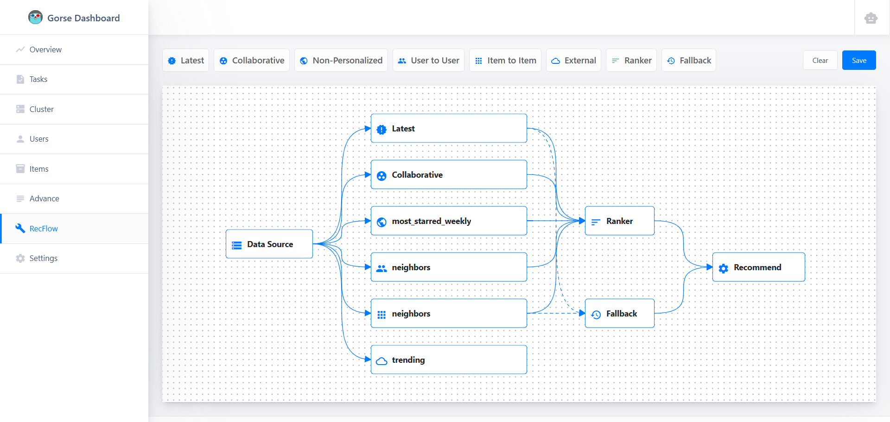
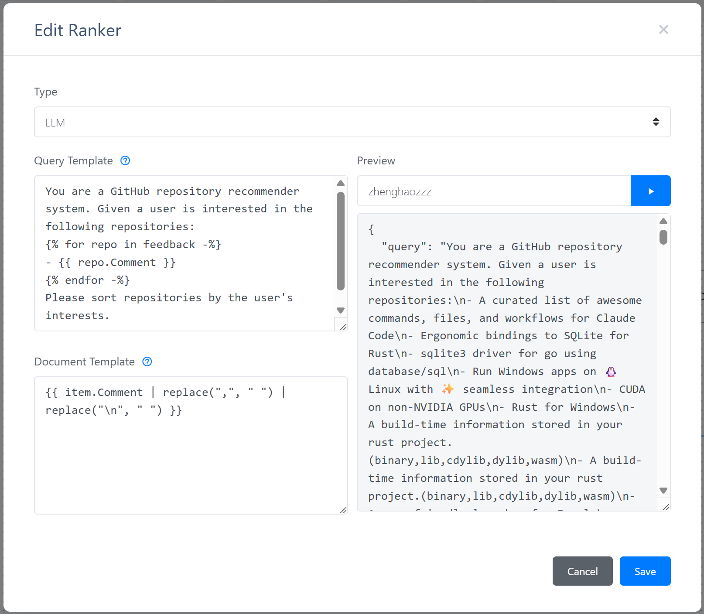

# 使用大语言模型排序推荐结果

Gorse 推荐系统在 [v0.5.2](https://github.com/gorse-io/gorse/releases/tag/v0.5.2) 到 [v0.5.5](https://github.com/gorse-io/gorse/releases/tag/v0.5.5) 版本引入了[可视化编排推荐流程](../docs/dashboard/recflow.md)和 [大语言模型重排](../docs/concepts/ranking.md) 两大新功能。本文将介绍如何结合这两项功能，使用可视化流程编辑器创建一个使用大语言模型重排器进行排序的推荐流程。

## 准备工作

首先需要准备好兼容 Jina 重排序 API 的服务，本文以阿里云百炼提供的重排序服务为例。

如果您已经部署好了 Gorse 推荐系统，需要将 API 地址、API 密钥和模型名称添加到配置文件的以下字段中：

```toml
[recommend.ranker.reranker_api]

# URL for the reranker API, supports Jina style.
url = "https://dashscope.aliyuncs.com/compatible-api/v1/reranks"

# Auth token for the reranker API.
auth_token = "RERANKER_API_KEY"

# The reranker model.
model = "qwen3-rerank"
```

也可以将这些字段通过环境变量覆盖：

```bash
GORSE_RERANKER_URL="https://dashscope.aliyuncs.com/compatible-api/v1/reranks"
GORSE_RERANKER_AUTH_TOKEN="RERANKER_API_KEY"
GORSE_RERANKER_MODEL="qwen3-rerank"
```

没有部署过 Gorse 也不用担心，可以启动一个临时的 Gorse 实例来体验这些功能：

```bash
docker run -p 8088:8088 \
  -e GORSE_RERANKER_URL="https://dashscope.aliyuncs.com/compatible-api/v1/reranks" \
  -e GORSE_RERANKER_AUTH_TOKEN="RERANKER_API_KEY" \
  -e GORSE_RERANKER_MODEL="qwen3-rerank" \
  zhenghaoz/gorse-in-one --playground
```

## 可视化编排

进入控制台（默认端口 8088），点击左侧导航栏的 *RecFlow*，进入推荐流程编辑器页面：



推荐流程的起点为数据源节点，终点为推荐节点，详细的节点介绍请参考[推荐流程文档](../docs/dashboard/recflow.md)，本文我们只关心基于 LLM 的排序节点。受限于上下文长度，LLM 没有办法对全体物品进行排序，因此先由多种召回推荐算法（如协同过滤、相似物品等）召回一批候选物品，这些候选物品合并后由排序节点进行排序。

双击排序节点，选择类型为 *LLM*，即可看到大语言模型重排的配置界面：



大语言模型重排器需要一个查询模板和一个文档模板，使用交互历史和候选集渲染 Jinja2 模板，然后将渲染好的提示词发送给 Reranker API。输入用户 ID 后点击运行按钮，预览功能将读取用户最近的反馈和最新物品，使用模板渲染将发送给 Reranker API 的内容。

保存推荐流程后，Gorse 将加载流程编辑器定义的推荐流程，而不是配置文件中的推荐流程。备用节点在 大语言模型重排器 中尤为重要，当 LLM 无法提供排序服务时，Gorse 将使用备用节点的推荐结果。

## 排序准确率评估

大语言模型重排的准确率需要使用 *gorse-bench* 工具进行评估。

1. 从代码仓库编译 [gorse-bench](https://github.com/gorse-io/gorse/tree/master/cmd/gorse-bench)
2. *gorse-bench* 暂时不支持流程编辑器定义的推荐流程，因此需要将推荐工作流的配置写入配置文件中。另外，数据库的访问方式也需要通过配置文件或者环境变量提供。
3. 运行以下命令评估 大语言模型重排器 的准确率：

```bash
./gorse-bench llm --config config.toml
```

此工具会读取用户的历史反馈，将反馈按照8:2的比例划分为训练集和测试集。针对每个用户，使用训练集中的正反馈渲染查询，使用测试集中的反馈（包括正反馈和负反馈）渲染文档，最后使用 GAUC[^1] 计算排序准确率：

$$
GAUC = \frac{\sum_{u\in U} n_u \cdot AUC_u}{\sum_{u\in U} n_u}
$$

其中 $AUC_u$ 是用户 $u$ 的 AUC，$n_u$ 是用户 $u$ 的测试集反馈数量。

开源的重排序模型并不是很多，本文只选择了当前看起来最先进的 Qwen3-Reranker 模型进行评测，并与因子分解机进行对比，数据集为 playground。为了观察大语言模型重排在不同训练样本数量下的表现，我们按照用户的训练集反馈数量将用户划分为五个组，分别计算每个组的 GAUC，结果如下：

::: echarts 大语言模型重排准确率对比

```json
{
  "legend": {
    "data": ["协同过滤", "FM", "Qwen3-Reranker-8B", "Qwen3-Reranker-4B", "Qwen3-Reranker-0.6B"]
  },
  "xAxis": {
    "name": "训练样本数量",
    "data": ["1-100", "101-200", "201-300", "301-400", "401-500"],
    "type": "category"
  },
  "yAxis": {
    "name": "GAUC",
    "type": "value",
    "min": 0.4
  },
  "tooltip": {
    "trigger": "item",
    "formatter": "{c}"
  },
  "series": [
    {
      "name": "FM",
      "data": [0.54675, 0.55576, 0.57201, 0.60794, 0.61463],
      "type": "bar"
    },
    {
      "name": "Qwen3-Reranker-8B",
      "data": [0.56780, 0.55635, 0.49727, 0.53735, 0.54233],
      "type": "bar"
    },
    {
      "name": "Qwen3-Reranker-4B",
      "data": [0.54130, 0.53804, 0.48226, 0.53537, 0.59649],
      "type": "bar"
    },
    {
      "name": "Qwen3-Reranker-0.6B",
      "data": [0.51439, 0.54621, 0.46890, 0.54301, 0.49056],
      "type": "bar"
    }
  ]
}
```
:::

实验结果显示：

1. **重排模型在冷启动场景下具有显著优势**：在样本数量较少时，Qwen3-Reranker-8B 的表现优于 FM 模型，说明专门训练的重排模型可以有效提升冷启动性能。
2. **传统模型随数据积累表现更佳**：随着训练数据量的增加，FM 模型的 GAUC 稳步提升，并最终超过了重排模型。这说明在数据充足的情况下，针对特定数据训练的传统模型仍然非常强大。
3. **模型规模对效果有直接影响**：Qwen3-Reranker-8B 在大多数情况下优于其 4B 和 0.6B 版本，说明模型规模对于重排质量的提升至关重要。

## 未来展望

本文只是对大语言模型重排非常初步的探索，我们后续会用更丰富的指标在更多的场景下测试更多的模型。未来也会探索微调大语言模型是否能进一步提升其排序能力，敬请期待！

[^1]: Zhou, Chang, et al. "Predict click-through rates with deep interest network model in e-commerce advertising." 2024 5th International Conference on Information Science, Parallel and Distributed Systems (ISPDS). IEEE, 2024.
